# Lecture 1: Union-Find

[toc]

## Dynamic Connectivity

### Problem

Given a set of $N$ objects, design efficient ***data structure*** for union-find:

-   `union()` command: ***connects*** two objects
-    `find()` (`connected()`) query: is there a path connecting the two objects.

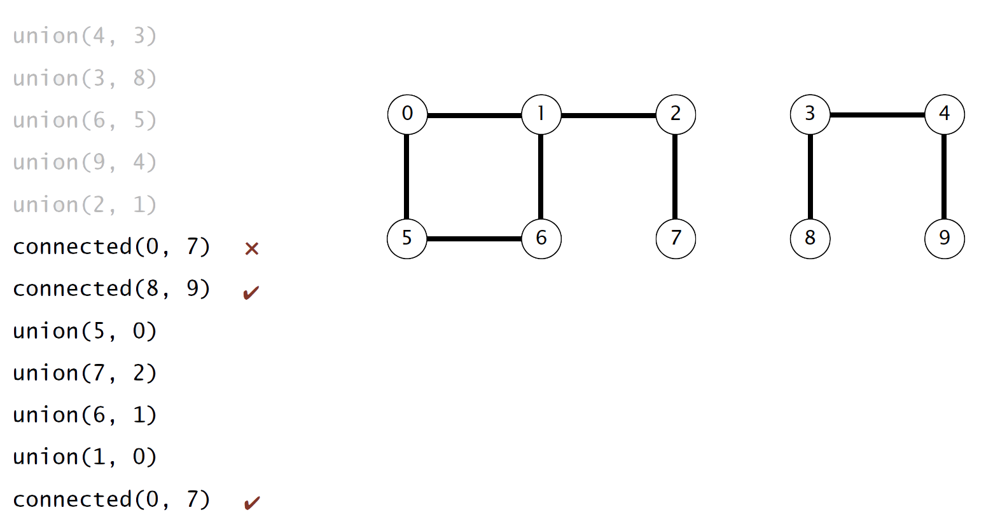

>   ***Note that***:
>
>   -   Number of ***objects*** $N$ can be ***huge***
>
>   -   Number of ***operations*** $M$ can be ***huge***
>   -   Find queris and union commands may be ***intermixed***

***Example***: *Is there a path from $p$ to $q$?*

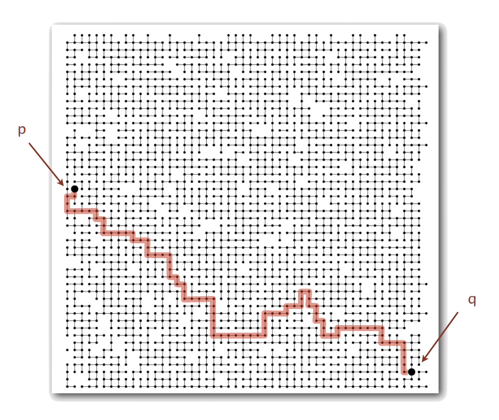

### Modeling

***Connections***:

Assume *"is connected to"* is an equivalence relation:

-   ***Reflexive***: $p$ is connected to $p$
-   ***Symmetric***: if $p$ is connected ed to $q$, then $q$ is connected to $p$
-   ***Transitivie***: if $p$ is connected to $q$ and $q$ is connected $r$, then $p$ is connected to $r$

***Connected Components***: 

Connected components are the maximal ***sets*** of objects that are ***mutually connected***.

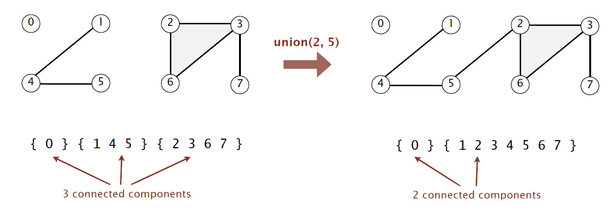

`find()` ***query***: *checks if the wo objects are in the same component*

`union()` ***command***: *replace components containing two objects with their union*

### Union-Find Data Type (API)

```java
public class UF{
     public UF(int N){
          /*
          initialise union-find data structure with N objects
          */
     }
     
     public void union(int p, int q){
          /*
          add connection between p and q
          */
     }
     
     public boolean connected(int p, int q){
          /*
          checks if p and q are in the same component
          */
     }
     
     public int find (int p){
          /*
          component identifier for p
          */
     }
     
     public int count(){
          /*
          returns the number of components
          */
     }
}
```

### Dynamic-Connectivity Client

-   Read in number of objects $N$ from standard input
-   Repeat:
    -   read in pair of integers from standard input
    -   if they are not yet connected, connect them and print out pair

```java
public static void main(String[] args) {
     int N = StdIn.readInt();
     UF uf = new UF(N);

     while (!StdIn.isEmpty()) {
          int p = StdIn.readInt();
          int q = StdIn.readInt();

          if (!uf.connected(p, q)) {
               uf.union(p, q);
               StdOut.println(p + " " + q);
          }
     }
}
```

## Quick Find (*Eager Approach*)

***Data Strcuture***

-   `int[] id` of size $N$
-   ***Interpretations***: $p$ and $q$ are connected ***if and only if*** (iff) they have the same _id_ 

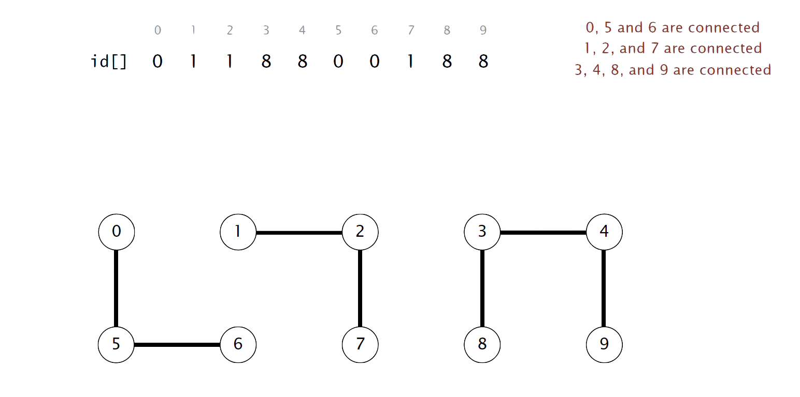

 ***Commands***

`find()`: checks if $p$ and $q$ have the same _id_

`union()`: to merge components containing $p$ and $q$, changes all entries whose _id_ equials `id[p]` to `id[q]`

***Java Implementation***

```java
public class QuickFindUF{
     private int[] id;
     
     public QuickFindUF(int N) {
          id = new int[N];
          for (int i = 0; i < N;i++ ){
               id[i] = i;
          }
     }
     
     public boolean connected(int p, int q){
          return id[p] == id[q]l
     }
     
     public void union(int p, int q){
          int pid = id[p];
          int qid = id[q];
          for (int i = 0; i < id.length; i++){
               if (id[i] == pid){
                    id[i] = qid;
               }
          }
               
     }
}
```

***Cost Model***

| Method        | Time Complexity |
| ------------- | --------------- |
| `initialise`  | $O(N)$          |
| `union()`     | $O(N)$          |
| `connected()` | $O(1)$          |

>   Too ***expensive***: takes $N^2$ array accesses to process sequence of $N$ union commands on $N$ objects

## Quick Union (*Lazy Approach*)

***Data Structure***

-   `int[] id` of sieze $N$
-   ***Interpretation***: `id[i]` is parent of `i`
-   ***Root*** of i is `id[id[id[...id[i]...]]]`

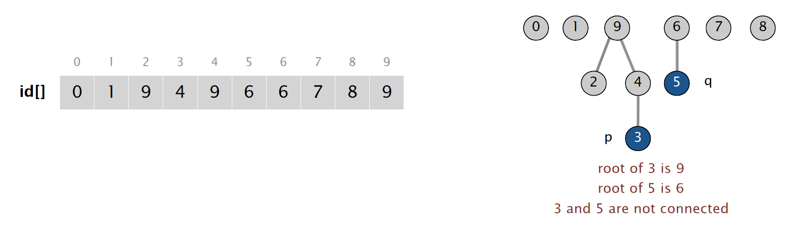

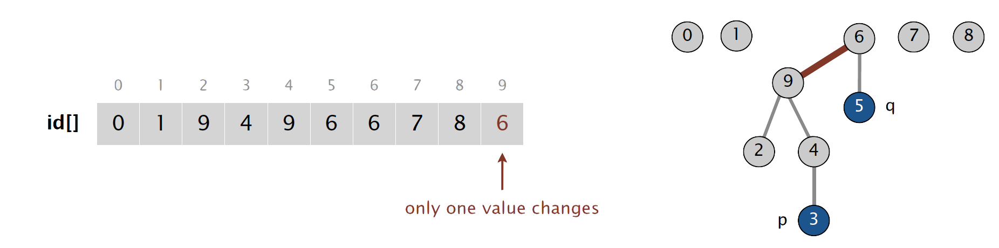

***Commands***

`find()`: checks if $p$ and $q$ have the same root

`union()`: to merge components containing $p$ and $q$, sets the _id_ of $p$'s root to the id of $q$'s root

***Java Implementation***

```java
public class QuickUnionUF{
     private int[] id;
     
     public QuickUnionUF(int N){
          id = new int[N];
          for (int i = 0; i < N; i++){
               id[i] = i;
          }
     }
     
     private int root(int i){
          while(i != id[i]){
               i = id[i];
          }
          return i
     }
     
     public boolean connected(int p, int q){
          return root(p) == root(q)
     }
     
     public void union(int p, int q){
          int i = root(p);
          int j = root(q);
          id[i] = j;
     }
}
```

***Cost Model***

| Method        | Time Complexity                         |
| ------------- | --------------------------------------- |
| `initialise`  | $O(N)$                                  |
| `union()`     | $O(N)$ (includes cost of finding roots) |
| `connected()` | $O(N)$ (worst case)                     |

>   ***Quick-find*** defects:
>
>   -   Union too expensive ($N$ array accesses)
>   -   Trees are flat, but too expensive tio keep them flat
>
>   ***Quick-union*** defects:
>
>   -   Tress can get tall
>   -   Find too expensive (could be $N$ array access)

## Quick Union Improvement

### Improvement 1: Weighted Quick Union

-   Modify quick-union to ***avoid tall trees***
-   Keep track of ***size*** of each tree (number of objects)
-   ***Balance*** by *linking root of smaller tree to root of larger tree*

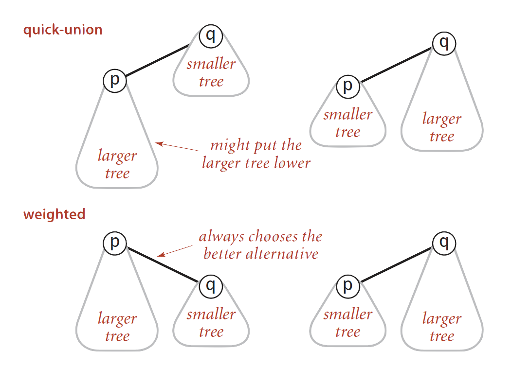

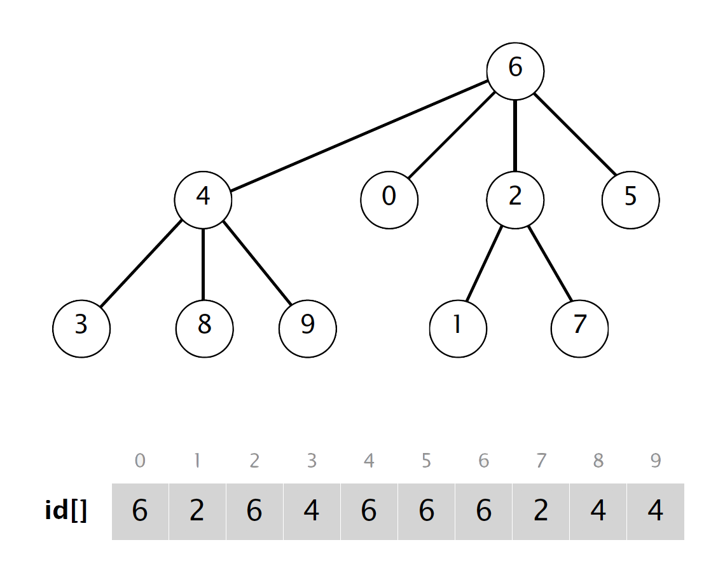

***Comparison***

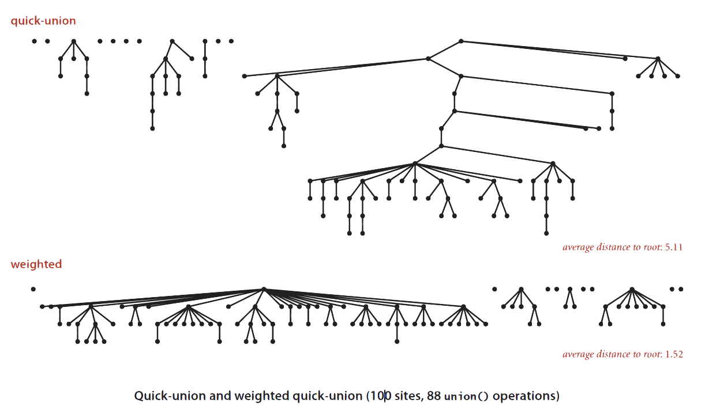

***Data Structure***

Same as quick-union, but maintain extrac array `sz[i]` to count number of objects in the tree rooted at `i`

***Commands***

`connected()`: itendtical to quick-union

`union()`: modify quick-union to:

-   Link root of smaller tree to root of larger tree
-   Update the `sz[]` arrya

***Java Implementation***

```java
public class QuickUnionUF{
     private int[] id;
     private int[] sz;
     
     public QuickUnionUF(int N){
          id = new int[N];
          sz = new int[N]
          for (int i = 0; i < N; i++){
               id[i] = i;
          }
          for (int i = 0; i < N; i++){
               sz[i] = 1;
          }
     }
     
     private int root(int i){
          while(i != id[i]){
               i = id[i];
          }
          return i
     }
     
     public boolean connected(int p, int q){
          return root(p) == root(q)
     }
     
     public void union(int p, int q){
          int i = root(p);
          int j = root(q);
          if (i == j) {
               return;
          }
          if (sz[i] < sz[j]) {
               id[i] = j;
               sz[j] += sz[i];
          } else {
               id[j] = i;
               sz[i] += sz[j]
          }
     }
}
```

***Running Time***

`connected()`: takes time proportional to depth of $p$ and $q$

`union()`: takes constant time, given roots

***Proposition***

Depth of any node $x$ is ***at most*** $\log_2 N$ (denote $\lg N$)

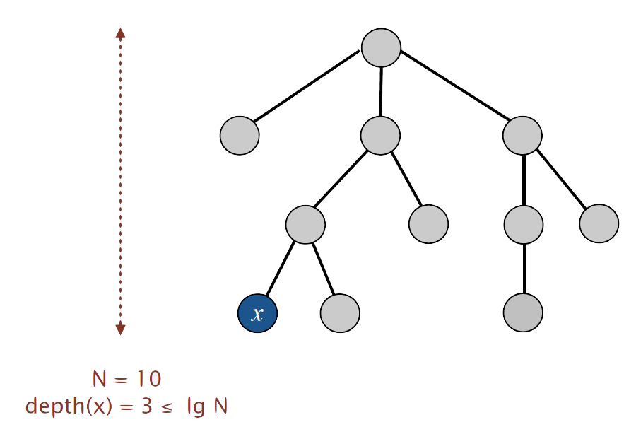


>   ***Proof***
>
>   *When does depth of $x$ increase?* It increase by 1 when tree $T_1$ containing $x$ is merged into another tree $T_2$
>
>   -   The size of the tree containing $x$ at least doubles since $|T_2| \ge |T_1|$
>
>   -   Size of tree containing $x$ can double at most $\lg N$ times because if you start with $1$:
>       $$
>       \begin{aligned}
>       1\times2^{\lg N} &= x \\
>       \lg x &= \lg N\\
>       x &= N\\
>       \end{aligned}
>       $$

| Method        | Time Complexity |
| ------------- | --------------- |
| `initialise`  | $O(N)$          |
| `union()`     | $O(\lg N)$      |
| `connected()` | $O(\lg N)$      |

### Improvement 2: Quick Union with Path Compression

Just after computing the root of $p$, set the id of each examined node to point to that root.

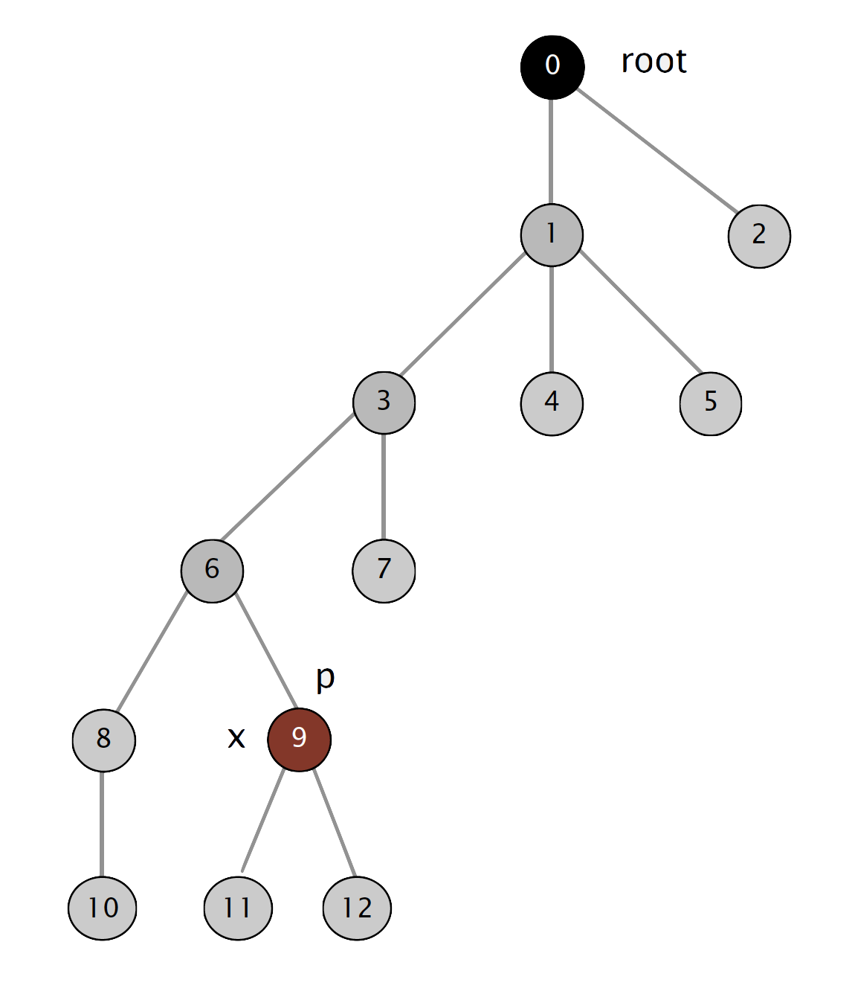

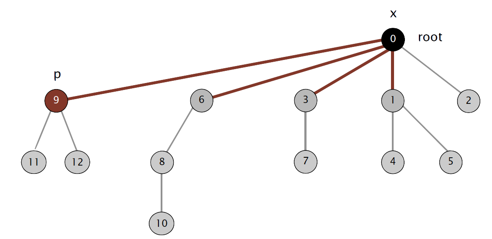

***Java Implementation***

-   **Two-Pass Implementation**: add second loop to `root()` to set the `id[]` of each examined node to the root

-   Simpler One-Pass Variant: Make every other node in path ***point to its granparent*** (thereby halving path length)

    ```java
    private int root(int i) {
         while (i != id[i]){
              id[i] = id[id[i]];
              i = id[i]
         }
         return i;
    }
    ```

### Weighted Quick-Union with Path Compression: Amortised Analysis

***Proposition***

Starting from an empty data structure, any sequence of $M$ union-find operations on $N$ objects makes $\le c(N+M \lg^*N)$ array accesses.

-   Analysis can be imprvoed to $N+M \alpha(M,N)$.
-   Simple algorithm with fascinating mathematics

>   $\lg^* N$ is the number of times you have to take the $lg$ of $N$ to get 1. 
>
>   | $N$         | $\lg^* N$ |
>   | ----------- | --------- |
>   | $1$         | $0$       |
>   | $2$         | $1$       |
>   | $4$         | $2$       |
>   | $16$        | $3$       |
>   | $65536$     | $4$       |
>   | $2^{65536}$ | $5$       |

## Summary

| Algorithm                      | Worst-case Time |
| ------------------------------ | --------------- |
| Quick-Find                     | $MN$            |
| Quick-Union                    | $MN$            |
| Wighted QU                     | $N + M \log N$  |
| QU + Path Compression          | $N + M \log N$  |
| Weighted QU + Path Compression | $N + M \lg^* N$ |

## Application: Percolation

***Modelling*** 

-   $N$-by-$N$ ***grid*** of sites
-   Each ***site*** is _open_ with probability $p$ (or _blocked_ with probability $1-p$)
-   System ***percolates*** iff *top and bottom are connected by open sites*.

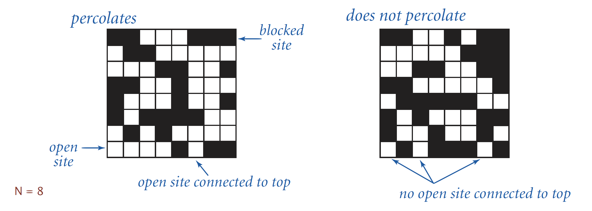

***Example for Physical Systems***

| Model              | System     | Vacant site | Occupied site | Percolates   |
| ------------------ | ---------- | ----------- | ------------- | ------------ |
| Electricity        | Material   | Conductor   | Insulated     | Conducts     |
| Fluid Flow         | Material   | Empty       | Blocked       | Porous       |
| Social Interaction | Population | Person      | Empty         | Communicates |

***Likelihood of Percolation***

Depends on site vacancy probability $p$

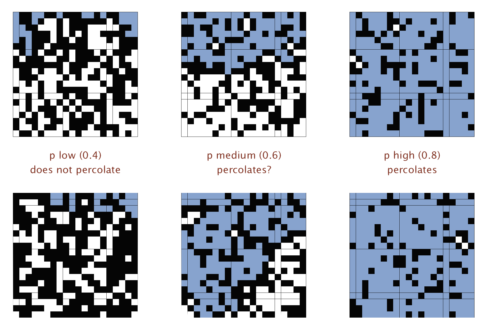

***Percolation Phase Transition***

When $N$ is large, theory guarantees a sharp threshold $p^*$

-   $p \gt p^*$: almost certainly percolates
-   $p \lt p^*$: almost certainly does not percolates

***Question***: What is the value of $p^*$

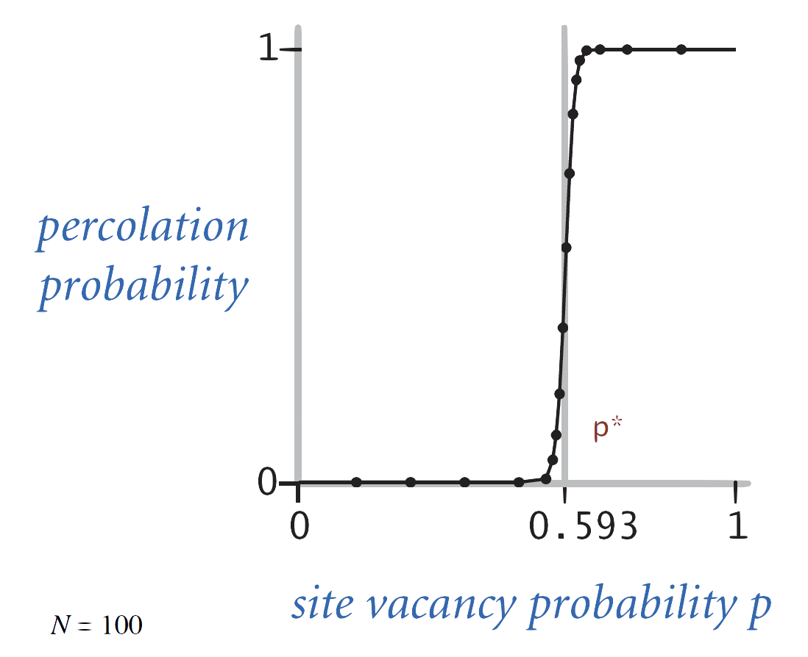

### Monte Carlo Simulation

-   Initialise $N$-by-$N$ whole grid to be _blocked_
-   Declare random sites _open_ until top conneceted to bottom
-   Vacancy percentage estimates $p^*$

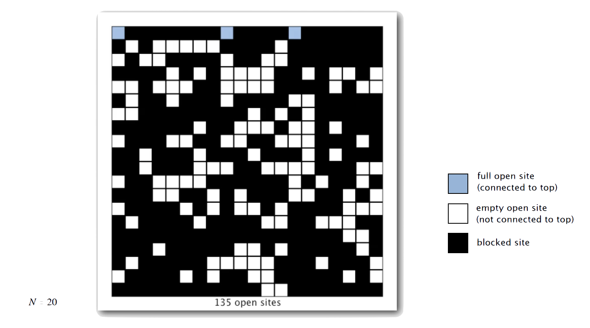

### Dynamic Connectivity Solution to Estimate Percolation Threshold

***Question***: How to check whether an $N$-by-$N$ system percolates?

-   Create an object for each site and index from $0$ to $N^2-1$
-   Sites are in same component if connected by open sites
-   ***Percolates*** iff any site on <u>bottom</u> row is connected to site on <u>top</u> row

***Brute-Force Algorithm***

$N^2$ calls to `connected()`

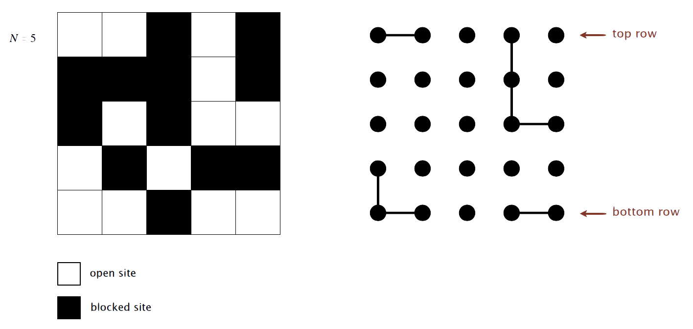

***Efficient Algorithm***

Only 1 call to `connected()`

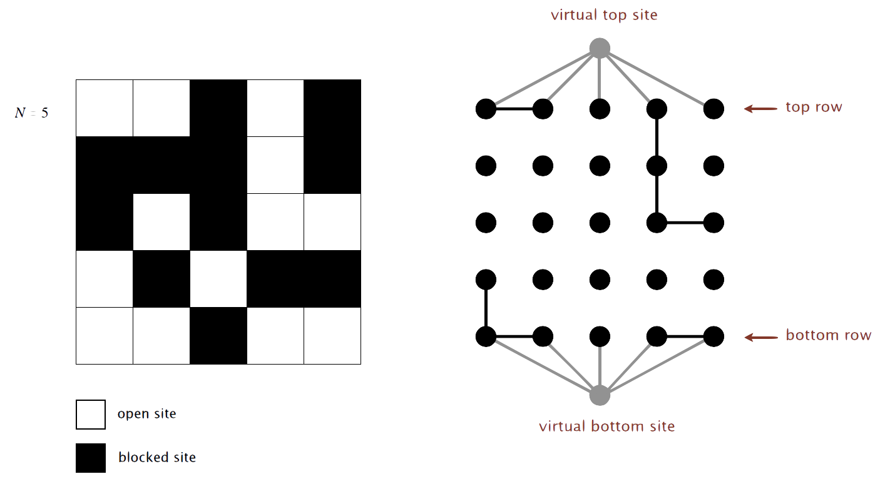

***Question***: How to model *opening a new site*?

Mark new site as _open_, connect it to all of its adjacent _open_ sites - up tp 4 calls to `union()`

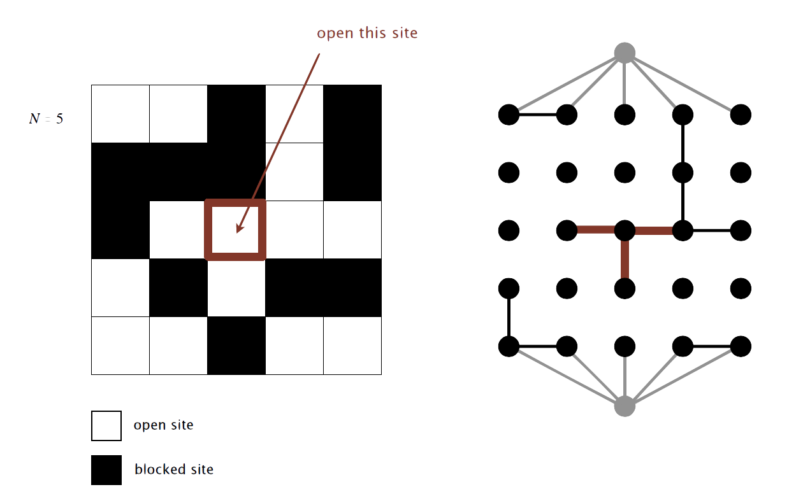

