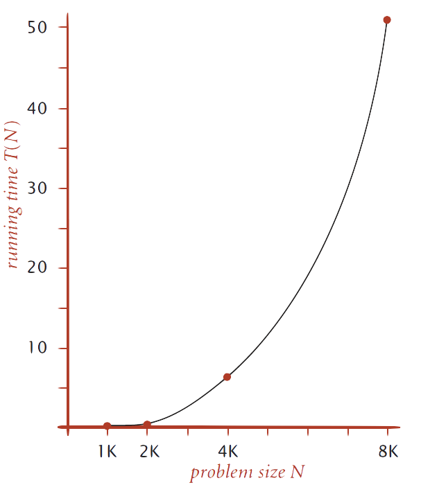
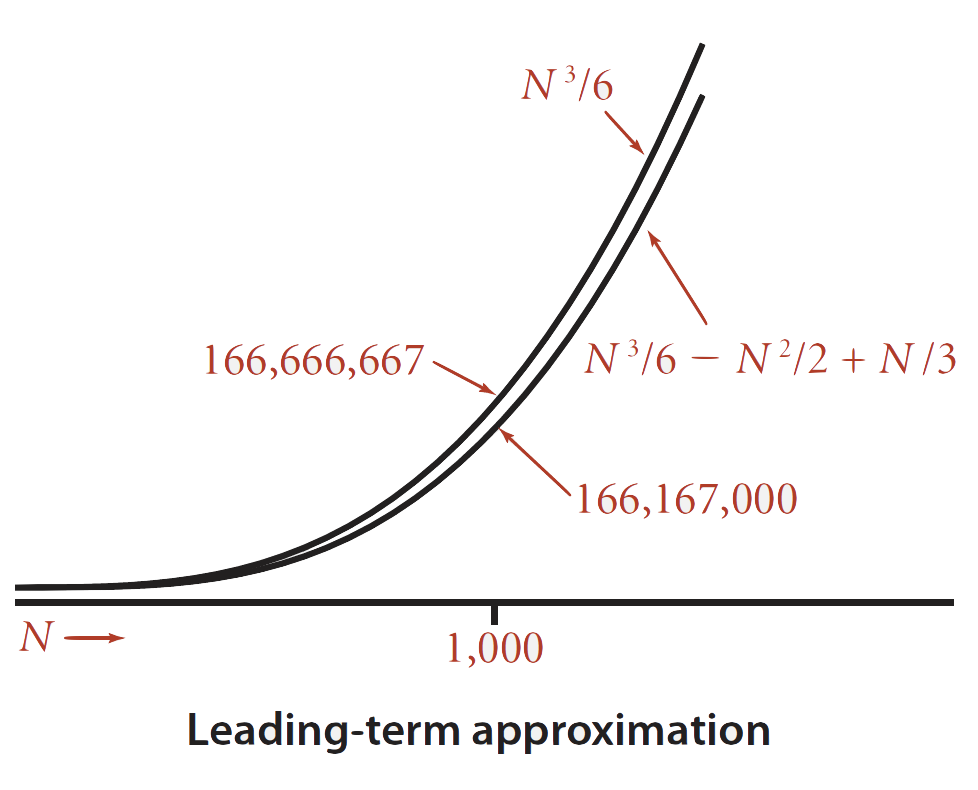
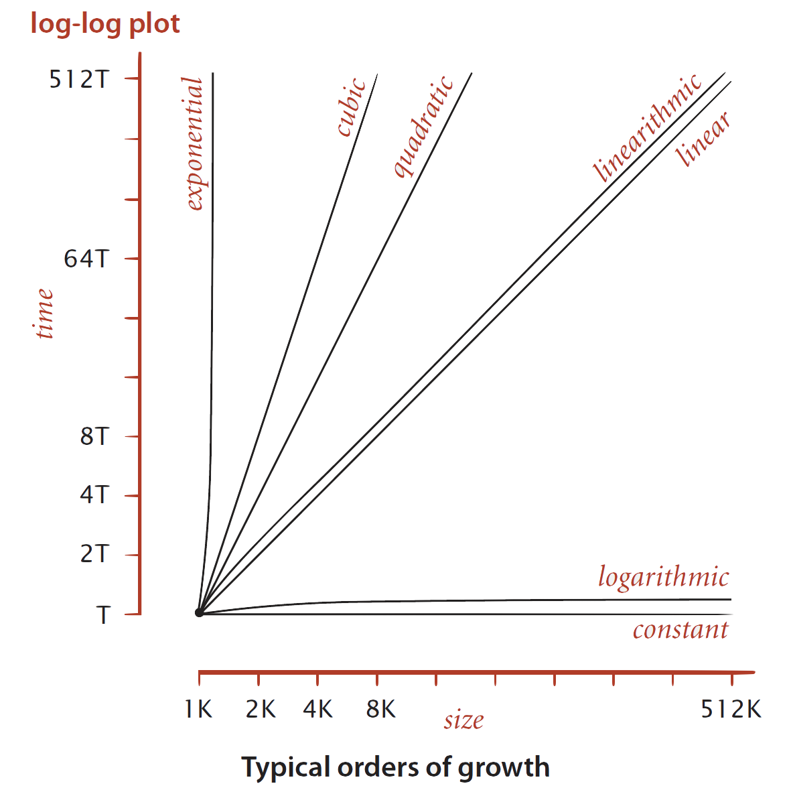
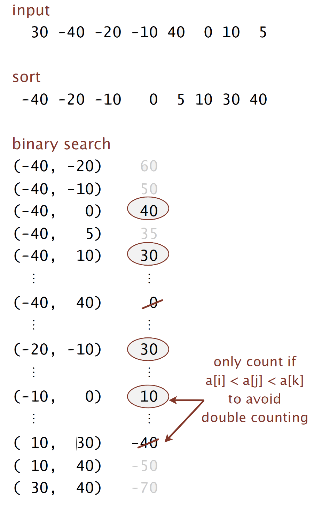
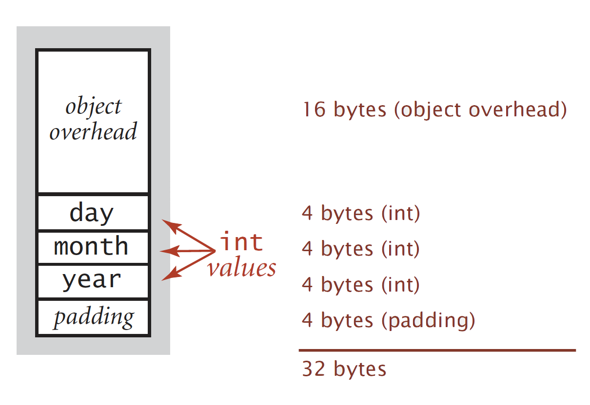
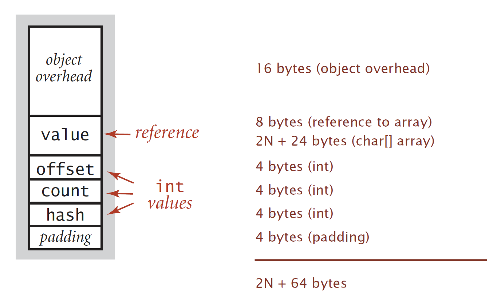

# Lecture 2: Analysis of Algorithms

## Data Analysis

***Standard Plot***

Plot running time $T(N)$ vs. input size $N$



***Log-log Plot***

Plot running time $T(N)$ vs. input size $N$ using log-log scale


Conduct ***regression analysis*** to fit straight line through data points: $aN^b$ (***"power law"***)
$$
\lg(T(N)) = b (\lg(N)) +c \\
b = 2.999 \\
c = -33.2103 \\
T(N) = 2^{-33.2103}N^2.999
$$

>   ***Hypothesis***: *the running time is about $1.006 \times 10^{-10} \times N^{2.999}$ seconds*

## Prediction and Validation

***Predictions***

-   $51.0$ seconds for $N = 8000$
-   $408.1$ seconds for $N = 16000$

***Observations***

|   $N$   | time (seconds) |
| :-----: | :------------: |
| $8000$  |     $51.1$     |
| $8000$  |     $51.0$     |
| $8000$  |     $51.1$     |
| $16000$ |    $410.8$     |

**Vlalidates hypothesis**

## Doubling Hypothesis

***Doubling hypothesis*** is a quick way to estimate $b$ in a power-law relationship

Run programme, ***doubling*** the size of input:

| $N$    | time (seconds) | ratio | $\lg$(ratio) |
| ------ | -------------- | ----- | ------------ |
| $250$  | $0.0$          | -     | -            |
| $500$  | $0.0$          | $4.8$ | $2.3$        |
| $1000$ | $0.1$          | $6.9$ | $2.8$        |
| $2000$ | $0.8$          | $7.7$ | $2.9$        |
| $4000$ | $6.4$          | $8.0$ | $3.0$        |
| $8000$ | $51.1$         | $8.0$ | $3.0$        |

>   $\lg(ratio)$ converges to constant $b\approx 3$

Running time is about $aN^b$ with $b=\lg(ratio)$, solve for $a$ with a sufficently large value of $N$.

>   ***Hypothesis***:
>
>   Running time is about $0.998 \times 10^{-10} \times N^3$ seconds

## Experimental Algorithms

### Determinants of $b$:

***System independent effects:***

-   Algorithm
-   Input data

### Determinants of $a$

***System independent effects:***

-   Algorithm
-   Input data

***System dependent effects:***

-   Hardware: CPU, memory, cache, ...
-   Software: complier, interpreter, garbage collector, ...
-   System: operating system, network, other apps, ...

## Mathematical Models for Running Time

### Cost Model

Use some basic operation as a proxy for running time.

***Example: 2-Sum***

```java
int count = 0;
for (int i = 0; i < N; i++) {
     for (int j = i+1; j < N; j++){
          if (a[i] + a[j] == 0) count ++;
     }
}
```

| Operation                         | Frequency                                                    |
| --------------------------------- | ------------------------------------------------------------ |
| Variable Declaration              | $N+2$                                                        |
| Assignment Statement              | $N+2$                                                        |
| _Less than_ Comparison            | $\frac{1}{2}(N+1)(N+2)$                                      |
| _Equal to_ Comparison             | $0 + 1 + 2 + \dots +(N-1) = \frac{1}{2}N(N-1) = {{N}\choose{2}}$ |
| ***Array access*** - *Cost Model* | $N(N-1)$                                                     |
| Increment                         | $\frac{1}{2}N(N-1)$ to $N(N-1)$                              |

>   Assuming compiler/JVM does not optimise array accesses away

### Tilde Notation

-   Estimating running time (or memory) as a function of input size $N$
-   Ignore lower order terms
    -   when $N$ is large, terms are negligible
    -   when $N$ is small, omit

***Examples***
$$
\begin{aligned}
\frac{1}{6}N^3 + 20N +16 &\sim \frac{1}{6}N^3 \\
\frac{1}{6}N^3 + 100N^{\frac{4}{3}} +56 &\sim \frac{1}{6}N^3 \\
\frac{1}{6}N^3 - \frac{1}{2}N^2 + \frac{1}{3}N &\sim \frac{1}{6}N^3
\end{aligned}
$$


*Discard lower-order terms*

>   ***Technical Definition***
>
>   $f(N) \sim g(N)$ means:
>   $$
>   \lim_{N \to \infty} \frac{f(N)}{g(N)} = 1
>   $$

***2-Sum Example with Tilde Notation***

| Operation                    | Frequency                                                    | Tilde Notation                       |
| ---------------------------- | ------------------------------------------------------------ | ------------------------------------ |
| Variable Declaration         | $N+2$                                                        | $\sim N$                             |
| Assignment Statement         | $N+2$                                                        | $\sim N$                             |
| _Less than_ Comparison       | $\frac{1}{2}(N+1)(N+2)$                                      | $\sim \frac{1}{2} N^2$               |
| _Equal to_ Comparison        | $0 + 1 + 2 + \dots +(N-1) = \frac{1}{2}N(N-1) = {{N}\choose{2}}$ | $\sim \frac{1}{2} N^2$               |
| ***Array access*** - *Proxy* | $N(N-1)$                                                     | $\sim N^2$                           |
| Increment                    | $\frac{1}{2}N(N-1)$ to $                                     | $\sim \frac{1}{2} N^2$ to $\sim N^2$ |

***Example: 3-Sum***

```java
int count = 0;
for (int i = 0; i < N; i++){
     for (int j = i+1; j < N; j++ ){
          if (a[i] + a[j] + a[k] == 0) count++;
     }
}
```

| Operation                    | Frequency                                  | Tilde Notation        |
| ---------------------------- | ------------------------------------------ | --------------------- |
| _Equal to_ Comparison        | ${N \choose {3}} = \frac{N(N-1)(N-2)}{3!}$ | $\sim \frac{1}{6}N^3$ |
| ***Array access*** - *Proxy* | $3 \times {N \choose 3}$                   | $\sim \frac{1}{2}N^3$ |

>   ***Note that:***
>
>   Each _Equal to_ Comparison has 3 array accesses

>   ***Estimating a Discrete Sum***
>
>   Replace the sum with an integral
>   $$
>   \begin{aligned}
>   \sum_{i = 1}^N i&\sim \int_{x=1}^N x\,dx \sim  \frac{1}{2}N^2 \\
>   \sum_{i = 1}^N i^k &\sim \int_{x=1}^N x^k\,dx \sim \frac{1}{k+1}N^{K+1} \\
>   \sum_{i = 1}^N \frac{1}{i} &\sim \int_{x=1}^N \frac{1}{x}\,dx = \ln N \\
>   \sum_{i=1}^N\sum_{j=1}^N\sum_{k=j}^N 1 &\sim \int_{x=1}^N\int_{y=x}^N\int_{z=1y}^N dz\,dy\,dx \sim \frac{1}{6}N^3
>   \end{aligned}
>   $$

## Sample Question:

***How many array accesses does the following code fragment make as a function of $n$?***

*(Assume the compiler does not optimize away any array accesses in the innermost loop.)*

```java
int sum = 0;
for (int i = 0; i < n; i++)
    for (int j = i+1; j < n; j++)
        for (int k = 1; k < n; k = k*2)
            if (a[i] + a[j] >= a[k]) sum++;
```

***Running Time of $k$-loop:***

Geometric Progression with $a = 1, r = 2$:
$$
\begin{aligned}
2^{T} &= N\\
T &= \lg N \\
\end{aligned}
$$
3 array accesses for `a[i], a[j], a[k]`:

Running Time of $k$-loop:
$$
 3\lg N
$$


***Number of time $k$-loop is Executed:***

The equivalent of _2-Sum_ problem 
$$
{N \choose 2} = \frac{1}{2}N^2
$$
***Array Accesses of the Function***:
$$
\frac{1}{2}N^2 \times  3\lg N = \frac{3}{2}N^2 \lg N
$$

## Order-of-Growth Classification

| Order-of-Growth | Name         | Typical Code Framework                                       | Description        | Example                 | $\frac{T(2N)}{T(N)}$ |
| --------------- | ------------ | ------------------------------------------------------------ | ------------------ | ----------------------- | -------------------- |
| $1$             | Constant     | `a = b + c`                                                  | Statement          | Addition of two numbers | $1$                  |
| $\log N$        | Logarithmic  | `while (N > 1) { N = N/2; ...}`                              | Divide in half     | Binary Search           | $\sim 1$             |
| $N$             | Linear       | `for (int i = 0; i < N; i++){...}`                           | Loop               | Find the max            | $2$                  |
| $N \log N$      | Linearithmic | `mergeSort()`                                                | Divide and conquer | Merge Sort              | $\sim 2$             |
| $N^2$           | Quadratic    | `for (int i = 0; i < N; i++) for (int j = 0; j < N; j++) {...}` | Double loop        | Check all pairs         | $4$                  |
| $N^3$           | Cubic        | `for (int i = 0; i < N; i++) for (int j = 0; j < N; j++) for (int k = 0; k < N; k++) {...}` | Triple loop        | check all triples       | $8$                  |
| $2^N$           | Exponential  | `combinatorial()`                                            | Exhaustive search  | Checks all subsets      | $T(N)$               |



## Binary Search

***Java Implementation***

```java
public static int binarySearch(int[] a, int key) {
     int lo = 0, hi = a.length-1;
     while (lo <= hi) {
          int mid = lo + (hi - lo) / 2;
          if (key < a[mid]) hi = mid - 1;
          else if (key > a[mid]) lo = mid + 1;
          else return mid;
     }
     return -1;
}
```

>   ***Function Facts*** 👀
>
>   -   Firt binary search published in 1946
>   -   First bug-free one published in 1962
>   -   Bug in Java's `Arrays.binarySearch()` discovered in 2006

***Propostion***

Binary search uses at most $1+\lg N$ key compares to search in a sorted array of size $N$

***Recurrence***

Define $T(N)$ as the number of key compares to binary search a sorted subarray of size $\le N$
$$
T(N) \le T(\frac{N}{2}) + 1
$$
for $N \gt 1$, with $T(1) = 1$

>   Omitting odd $N$ case

***Proof Sketch***
$$
\begin{aligned}
T(N) &\le T(\frac{N}{2}) + 1 \\
&\le T(\frac{N}{4}) + 1 + 1 \\
&\le T(\frac{N}{8}) + 1 + 1 + 1 \\
&\dots \\
&\le T(\frac{N}{N}) + 1 + 1  + \dots + 1 \\
&= 1 + \lg N
\end{aligned}
$$

## An $N^2 \log N$ Algorithm for 3-Sum

***Sorting based algorithm*** 

1.  ***Sort*** the $N$ (distinct) numbers
2.  For each pair of numbers `a[i]` and `a[j]`, ***binary search*** for `-(a[i] + a[j])`



***Analysis***

-   $N^2$ with ***insertion sort***
-   $N^2\lg{N}$ with ***binary search***

## Theory of Algorithms

### Cases

***Best Case***: Lower bound of cost

-   Determined by "easiest" input
-   Provides a goal for all inputs

***Worst Case***: Upper bound on cost

-   Determined by "most difficult" input
-   Provides a guarantee for all inputs

***Average Case***: Expected cost for random input

-   Need a ***model*** for "random" input
-   Provides a way to predict performance

***Example: Array Accesses for Brute-Force 3-Sum***

-   **Best**: $\sim \frac{1}{2}N^3$
-   **Average**: $\sim \frac{1}{2}N^3$
-   **Worst**: $\sim \frac{1}{2}N^3$

***Example: Compares for Binary Search***

-   **Best**: $\sim 1$
-   **Average**: $\sim \lg N$
-   **Worst**: $\sim \lg N$

>   ***Actual Data Might Not Match Input Model?***
>
>   Need to understand input to effectively process it
>
>   -   Approach 1: design for the worst case
>   -   Approach 2: randomise, depend on probabilistic guarantee

### Goals

-   Eastablish "difficulty" of a problem
-   Develop "optimal" algorithms

***Approaches***

-   Suppress details in analysis: analyse "to within a constant factor"
-   Eliminate variability in input model by focusing on the worst case

***Optimal Algorithm***

-   ***Performance guarantee*** (to within a constant factor) for ***any input***
-   ***No algorithm*** can provide a better performance guarantee

### Commonly-Used Notations

| Notation  | Provides                  | Example       | Shorthand for                                    | Used to                   |
| --------- | ------------------------- | ------------- | ------------------------------------------------ | ------------------------- |
| Tilde     | Leading term              | $\sim 10 N^2$ | $10N^2, 10N^2 + 22 N \log N, 10N^2 + 2N + 37$    | Provide approximate model |
| Big Theta | Asympototic growth rate   | $\Theta(N^2)$ | $\frac{1}{2}N^2, 10N^2, 5N^2 + 22 N \log N +3 N$ | Classify algorithms       |
| Big Oh    | $\Theta(N^2)$ and smaller | $O(N^2)$      | $10N^2, 100N, 22N \log N +3N$                    | Develop upper bounds      |
| Big Omega | $\Theta(N^2)$ and larger  | $\Omega(N^2)$ | $\frac{1}{2}N^2, N^5, N^3 + 22 N \log N + 3N$    | Develop lower bounds      |

>   ***Note that***:
>
>   It is a common mistake to interpret big-Oh as an approximate model. It develops the upper bounds instead

### Example 1

***Goals***

-   Establish "difficulty" of a problem and develop "optimal" algorithms

-   **Example**: 1-Sum: *"Is there a 0 in the array?"*

***Upper Bound***: a specific alogrithm

-   **Example**: Brute-force 1-Sum
-   Running time of the optimal algorithm for 1-Sum is $O(N)$

***Lower Bound***: proof that no algorithm can do better

-   For any algorithm, it has to examine all $N$ entries
-   Running time of the optimal algorithm for 1-Sum is $\Omega(N)$

***Derived Optimal Algorithm***

-   Lower bound equals upper bound (to within a constant factor)
-   **Conclusion**: Brute-force 1-Sum is optimal: its running time is $\Theta(N)$

### Example 2

***Goals***

-   Establish "difficulty" of a problem and develop "optimal" algorithms

-   **Example**: 3-Sum

***Upper Bound***: a specific alogrithm

-   **Example**: Brute-force 3-Sum
-   **However**, Sorted-based 3-Sum performance better
-   Running time of the optimal algorithm for 1-Sum is $O(N^2 \log N)$

***Lower Bound***: proof that no algorithm can do better

-   For any algorithm, it has to examine all $N$ entries
-   Running time of the optimal algorithm for 1-Sum is $\Omega(N)$

***Open Problems***

-   Maybe better algorithm
-   Subquadratic algorithm?
-   Quadratic lower bound?

### Algorithm Design Approach

***Start***

-   ***Develop*** an algorithm
-   ***Prove*** a lower bound

***Gap?***

-   ***Lower*** the upper bound - discover a new algorithm
-   ***Raise*** the lower bound - more difficult

***Cavests***

-   Overly pessimistic to focus on worst case?
-   Need better than "to within a constant factor" to predict performance

## Memory

### Basics

| Unit          | Coversion      |
| ------------- | -------------- |
| Bit           | $\in \{0,1\}$  |
| Byte          | $8$ bits       |
| Megabyte (MB) | $2^{20}$ bytes |
| Gigabyte (GB​) | $2^{30}$ bytes |

>   ***64-bit Machine***: we assume 64-bit machine with ***8 bytes pointers***
>
>   -   can address more memory
>   -   pointers use more space - *but some JVMs "compress" ordinary object pointers to 4 bytes to avoid this cost*

### Typical Memory Usage for Primitive Types and Arrays

***Primitive Types***

| type      | bytes |
| --------- | ----- |
| `boolean` | 1     |
| `byte`    | 1     |
| `char`    | 2     |
| `int`     | 4     |
| `float`   | 4     |
| `long`    | 8     |
| `double`  | 8     |

***One-dimensional Arrays***

| type       | bytes    |
| ---------- | -------- |
| `char[]`   | $2N+24$  |
| `int[]`    | $4N +24$ |
| `double[]` | $8N +24$ |

***Two-dimensional Arrays***

| type         | bytes      |
| ------------ | ---------- |
| `char[][]`   | $\sim 2MN$ |
| `int[][]`    | $\sim 4MN$ |
| `double[][]` | $\sim 8MN$ |

### Typical Memory Usage for Objects in Java

| object            | bytes                                    |
| ----------------- | ---------------------------------------- |
| _Object overhead_ | 16                                       |
| _Reference_       | 8                                        |
| **_Padding_**     | *each object uses a multiple of 8 bytes* |

***Example 1***

A _Date_ object uses 32 bytes of memory

```java
public class Date {
     private int day;
     private int month;
     private int year;
     ...
}
```



***Example 2***

A virgin _String_ of length $N$ uses $\sim 2N$ bytes of memory

```java
public class String {
     private char[] value;
     private int offset;
     private int count;
     private int hash;
     ...
}
```



***Shallow Memory Usage***: don't count referenced objects

***Deep Memory Usage***: if array entry or instance variable is a reference, add memory (recursively) for referenced object

