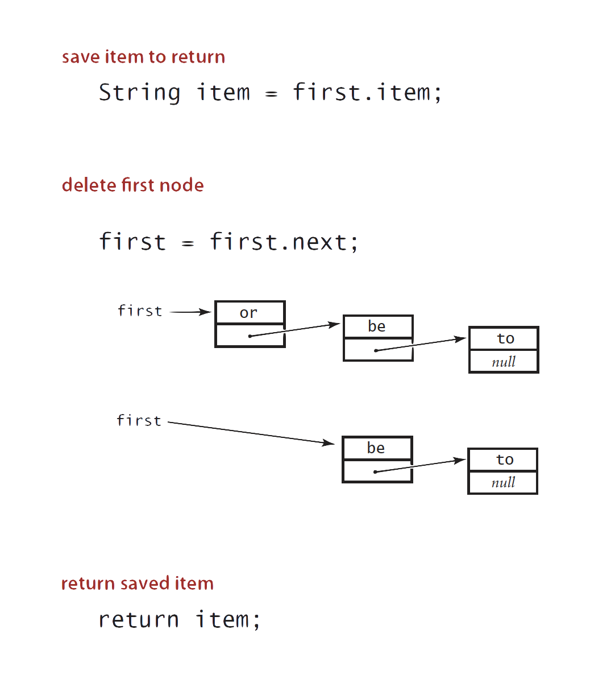

# Lecture 3: Stacks and Queues

## Stack

### Warmup

***API***

Stack of _String_ data type

```java
public class StackOfStrings {
     
     // create an empty stack
     public StackOfStrings() {
          ...
     }
     
     // insert a new string onto stack
     public void push(String item) {
          ...
     }
     
     // remove and return the string most recently added
     public String pop() {
          ...
     }
     
     // is the stack empty?
     public boolean isEmpty() {
          ...
     }
     
     // number of strings on the stack
     public int size() {
          ...
     }
}
```

***Test Client***

Read _String_ from standard input:

-   if _String_ equals "-", `pop()` _String_ from stack and `print()`
-   Otherwise, `push()` _String_ onto stack

```java
public static void main (Strings[] args) {
     StackOfStrings stack = new StackOfStrings();
     while(!StdIn.isEmpty()) {
          String s = StdIn.readString();
          if (s.equals("-")) StdOut.print(stack.pop());
          else stack.push(s);
     }
}
```

***Example***

```bash
% more tobe.txt
to be or not to - be - - that - - - is

% java StackOfStrings < tobe.txt
to be not that or be
```


### Linked-List Implementation

Maintain pointer to first node in a linked list, insert/remove from front


***Inner Class***

```java
private class Node {
     String item;
     Node next;
}
```

***Java Implementation***

```java
public class LinkedStackOfStrings {
     private Node first = null;
     
     private class Node {
          String item;
          Node next;
     }
     
     public boolean isEmpty() { 
          return first == null;
     }
     
     public void push(String item) {
          Node oldfirst = first;
          first = new Node();
          first.item = item;
          first.next = oldfirst;
     }
     
     public String pop() {
          String item = first.item;
          first = first.next;
          return item;
     }
}
```

`pop()` ***Implementation***



`push()` ***Implementation***


***Performance***

**Proposition**: every operation takes constant time in the worst case

**Proposition**: A stack with $N$ items uses $\sim 40N$ bytes


>   ***Note that***:
>
>   This accounts for the memory for the stack, but not the memory for _String_ themselves, which the client owns

### Array Implementation

-   use array `s[]` to store $N$ items on stack
-   `push()` adds new item at `s[N]`
-   `pop()` removes item from `s[N-1]`


>   ***Defect***:
>
>   _Stack_ overflows when $N$ exceeds capacity, but this will be addressed in following lectures

***Java Implementation***

```java
public class FixedCapacityStackOfStrings {
     private String[] s;
     private int N = 0;
     
     public FixedCapacityStackOfStrings (int capacity) {
          s = new String[capacity];
     }
     
     public boolean isEmpty() {
          return N  == 0;
     }
     
     public void push(String item) {
          // N++ used to index into array then increment N
          s[N++] = item;
     }
     
     public String pop() {
          // decrement N then use to index into array
          return s[--N]
     }
}
```

***Consideration***

**Overflow**: use resizing array for array implementation

**Underflow**: throw exception if pop from an empty stack

**Null items**: allow _null_ items to be inserted

>   ***Loitering***: 
>
>   holds a reference to an object when it is no longer needed
>
>   **Solution**:
>
>   ```java
>   public String pop() {
>       String item = s[--N];
>       s[N] = null;
>       return item;
>   }
>   ```
>
>   Garbage collector can reclaim memory, but only if no outstanding references

### Resizing-Arrays Implementation

#### First Try

-   `pop()`: increase size of array `s[]` by 1
-   `push()`: decrease size of array `s[]` by 1

***Problems***

-   need to copy all items to a new array
-   inserting first $N$ items takes proportional to $1 + 2 + \dots + N \sim \frac{N^2}{2}$

>   ***Challenge***:
>   Ensure that array resizing happens infrequently

#### Growing Array Efficiently: Repeated Doubling

If array is full, create a new array of ***twice*** the size, and copy items

```java
public class ResizingArrayStackOfStrings {
     private String[] s;
     private int N = 0;
     
     public ResizingArrayStackOfStrings() {
          s = new String[1]
     }

     public void push(String item) {
          if (N == s.length) resize(2 * s.length);
          s[N++] = item;
     }

     private void resize(int capacity) {
		String[] copy = new String[capacity];
          for (int i = 0; i < N; i++) {
               copy[i] = s[i];
          }
          s = copy;
     }
}
```

***Cost of Inserting First $N$ Items***
$$
N + (2 + 4 + 8 + \dots + N) \sim 3N
$$

-   $N$: $1$ array access per push
-   $2 + 4 + 8 + \dots + N$: $k$ array accesses to double to size $k$ (ignorering cost to create new array)


>   ***Note that***:
>
>   Performing $n$ `push()` will call the `resize()` method to a logarithmic time because it will be called only when the array size is a power of 2, and there are $\sim \log_2 n$ powers of 2 between 1 and $n$.

#### Shrinking Array Efficiently

***First Try***

-   `push()`: double size of array `s[]` when array is full
-   `pop()` halve size of array `s[]` when array is ***one-half full***

>   ***Thrashing***:
>
>   -   Consider `push()`-`pop()`-`push()`-`pop()` ... sequence when array is full
>   -   Each operation takes time proportional to $N$
>
>   

***Efficient Solution***

-   `push()`: double size of array `s[]` when array is full
-   `pop()`: halve size of array `s[]` when array is ***one-quarter full***

```java
public String pop() {
     String item = s[--N];
     // N is not the same as index
     s[N] = null;
     if (N>0 && N == s.length/4) resize(s.length/2);
     return item;
}
```

>   ***Invariant***:
>
>   Array is between 25% and 100% full


***Performance***

>   ***Amortised Analysis***: average running time per operation over a worst-case sequence of operations

**Proposition**: starting from an empty stack, any sequence of $M$ `push()` and `pop()` operations takes time propotional to $M$


***Memory Usage***

**Proposition**: uses between $\sim 8N$ and $\sim 32 N$ bytes to represent a stack with $N$ items

-   $\sim 8 N$ when full
-   $\sim 32 N$ when one-quarter full


***Resizing Array vs. Linked List***

| Algorithm                     | Performance                                                 | Memory Usage                                     |
| ----------------------------- | ----------------------------------------------------------- | ------------------------------------------------ |
| Linked-List Implementation    | Every operation takes constant time in the ***worst case*** | Uses extra time and space to deal with the links |
| Resizing-Array Implementation | Every operation takes constant ***amortised*** time         | Less wasted space                                |


## Queues

### API

```java
public class QueueOfStrins {
     public QueueOfStings() {
          // create am empty queue
          ...
     }
     
     public void enqueue(String item) {
          // insert a new String onto queue
          ...
     }
     
     public String dequeue() {
          // remove and return the String least recently added
          ...
     }
     
     public boolean isEmpty() {
          // is the queue empty
          ...
     }
     
     public int size() {
          // number of String on the queue
     }
}
```

### Linked-List Implementation

Maintain ***pointers*** to first and last nodes in a linked list, insert/remove from opposite ends


***Dequeue***


>   ***Remark***:
>
>   Identical code to linked-list stack `pop()`

***Enqueue***


***Java Implementation***

```java
public class LinkedQueueOfStrings {
     private Node first, last;
     
     private class Node {
          /* same as in StackOfStrings*/
     }
     
     public boolean isEmpty() {
          return first == null;
     }
     
     public void enqueue(String item) {
          Node oldlast = last;
          last = new Node();
         	last.item = item;
          last.next = null;
          if (isEmpty()) first = last;
          else oldlast.next = last;
     }
     
     public String dequeue() {
          String item = first.item;
          first = first.next;
          if (isEmpty()) last = null;
          return item;
     }
}
```

### Resizing-Array Implementation

-   Use array `q[]` to store items in queue
-   `enqueue()`: add new item at `q[tail]`
-   `dequeue()`: remove new item from `q[head]`
-   Update `head` and `tail` modulo the `capacity`
-   Add resizing array


## Generics

### Parameterised Stack

Implemented: `StackOfStrings`

Also wanted: `StackOfURLs`, `StackOfInts`, `StackOfVans`...

***Attempt 1***: Implement a separate stack class for each type

-   Rewriting code is tedious and error-prone
-   Maintaining cut-and-pasted code is tedious and error-prone

>   ***Fun Fact***:
>
>   This is the most reasonable approach until Java 1.5.

***Attempt 2***: Implement a stack with items of type _Object_

-   Casting is required in client
-   Casting is error-prone: run-time error if types mismatch

```java
StackOfObjects s = new StackOfObjects();
Apple a = new Apple();
Orange b = new Orange();
s.push(a);
s.push(b);

a = (Apple) (s.pop());
// run-time error
```

***Attempt 3*: Java Generics**

-   Avoid casting in client
-   Discover type mismatch errors at compile-time instead of run-time

```java
Stack<Apple> s = new Stack<Apple>();
Apple a = new Apple();
Orange b = new Orange();
s.push(a);
s.push(b);
// compile-time error
a = s.pop();
```

>   ***Note that***:
>
>   `<Apple>` is type parameter

### Generic Stack: Linked-List Implementation

```java
public class Stack<Item> {
     private Node first = null;
     
     private class Node {
          Item item;
          Node next;
     }
     
     public boolean isEmpty()
     { return first == null; }
     
     public void push(Item item) {
          Node oldfirst = first;
          first = new Node();
          first.item = item;
          first.next = oldfirst;
     }
     
     public Item pop() {
          Item item = first.item;
          first = first.next;
          return item;
     }
}
```

>   ***Note that***:
>   `Item` is generic type name

### Generic Stack: Array Implementation

***Intuitively***:

```java
public class FixedCapacityStack<Item> {
     private Item[] s;
     private int N = 0;
     
     public FixedCapacityStack(int capacity) { 
          s = new Item[capacity]; 
          // ILLEGAL
          // generic array creation not allowed in Java
     }
     
     public boolean isEmpty()
     { return N == 0; }
     
     public void push(Item item)
     { s[N++] = item; }
     
     public Item pop()
     { return s[--N]; }
}
```

***Solution***:

```java
public class FixedCapacityStack<Item> {
     private Item[] s;
     private int N = 0;
     
     public FixedCapacityStack(int capacity) { 
          s = (Item[]) new Object[capacity]; 
          // the ugly cast
          // casting should be avoided if possible
     }
     
     public boolean isEmpty()
     { return N == 0; }
     
     public void push(Item item)
     { s[N++] = item; }
     
     public Item pop()
     { return s[--N]; }
}
```

>   ***Unchecked Cast***
>
>   If compile `FixedCapacityStack.java`:
>
>   ```bash
>   % javac FixedCapacityStack.java
>   Note: FixedCapacityStack.java uses unchecked or unsafe operations.
>   Note: Recompile with -Xlint:unchecked for details.
>   
>   % javac -Xlint:unchecked FixedCapacityStack.java
>   FixedCapacityStack.java:26: warning: [unchecked] unchecked cast
>   found : java.lang.Object[]
>   required: Item[]
>   a = (Item[]) new Object[capacity];
>                ^
>   1 warning
>   ```

### Generic Data Types

>   ***Wrapper Type***:
>
>   -   Each ***primitive*** type has a ***wrapper*** object type
>   -   Example: _Integer_ is wrapper type for _int_

***Autoboxing***

Automatic cast between a primitive type and its wrapper

```java
Stack<Integer> s = new Stack<Integer>();
s.push(17); // s.push(Integer.valueOf(17));
int a = s.pop(); // int a = s.pop().intValue();
```

***Conclusion***: client code can use generic stack for ***any*** type of data

## Iterators

***Design Challenge***

Support iteration over stack items by client, without revealing the internal representation of the stack


***Java Solution***:

Make stack implement the `java.util.Iterable` interface

>   ***Iterable***:
>
>   Has a method that returns an _Iterator_
>
>   *Iterable Interface*:
>
>   ```java
>   public interface Iterable<Item> {
>        Iterator<Item> iterator();
>   }
>   ```

>   ***Iterator***:
>
>   Has methods `hasNext()` and `next()`
>
>   *Iterator Interface*:
>
>   ```java
>   public interface Iterator<Item> {
>        boolean hasNext();
>        Item next();
>        void remove(); //optional and risky to use
>   }
>   ```

***Why Make Data Structures Iterable?***

Java supports elegant client code

**_foreach_ statement (shorthand)**

```java
for (String s : stack) {
     StdOut.println(s);
}
```

**equivalent code (longhand)**

```java
Iterator<String> i = stack.iterator();
while (i.hasNext()) {
     String s = i.next();
     StdOut.println(s);
}
```

### Stack Iterator: Linked-List Implementation

```java
import java.util.Iterator;

public class Stack<Item> implements Iterable<Item> {
     ...
     public Iterator<Item> iterator() {
          return new ListIterator();
     }
     
     private class ListIterator implements Iterator<Item> {
          private Node current = first;
          
          public boolean hasNext() {
               return current != null;
          }
          public void remove() {
               /* not supported */
          }
          public Item next() {
               Item item = current.item;
               current = current.next;
               return item;
          }
     }          
}
```

### Stack Iterator: Array Implementation

```java
import java.util.Iterator;

public class Stack<Item> implements Iterable<Item> {
     ...
     public Iterator<Item> iterator() {
          return new ReverseArrayIterator();
     }
     
     private class ReverseArrayIterator implements Iterator<Item> {
          private int i = N;
          
          public boolean hasNext() {
               return i > 0;
          }
          public void remove() {
               /* not supported*/
          }
          public Item next() {
               return s[--i];
          }
     }
}
```

### Bag API

Adding items to a collection and iterating (when order doesn't matter)

```java
public class Bag<Item> implements Iterable<Item> {
     public Bag() {
          // create an empty bag
          ...
     }
     
     public void add(Item x) {
          // insert a new item onto bag
          ...
     }
     
     public int size() {
          // number of items in bag
          ...
     }
     
     public Iterable<Item> iterator() {
          // iterator for all items in bag
          ...
     }
     
     ...
}
```

***Implementation***

_Stack_ with `pop()` or _Queue_ without `dequeue()`

### Question

***Q:*** *Suppose that we copy the iterator code from our linked list and resizing array implementations of a stack to the corresponding implementations of a queue. Which queue iterator(s) will correctly return the items in FIFO order?*

***A:*** linked-list iterator only

>   ***Note that***:
>
>   The linked-list iterator will work without modification because the items in the linked list are ordered in FIFO order (which is the main reason we dequeue from the front and enqueue to the back instead of vice versa).
>
>   The array iterator will fail for two reasons. First, the the items should be iterated over in the opposite order. Second, the items won't typically be stored in the array as entries $0$ to $n-1$.

