# Lecture 4: Elementary Sorts

[toc]

## Rules of the Game

### Sorting Problem

To create an algorithm that implements a _static_ method `sort()`, which sorts an array of ***any*** type of data

### Callbacks

***Question:*** 

*How can `sort()` know how to compare data of different type (both primitive and object) without any information about the type of an item’s key?*

***Solution:***

- Client passes array of objects to `sort()` function
- The `sort()` function ***calls back*** object’s `compareTo()` method as needed

> ***Callback***:
>
> A reference to executable code

#### Implementing Callbacks in Different Languages

- _Java_: **interfaces**
- _C_: function pointers
- _C++_: class-type funtors
- _C#_: delegates
- _Python, Perl, ML, JavaScript_: first-class functions

#### Roadmap

***Client***:

```java
import java.io.File;
public class FileSorter {
	public static void main(String[] args) {
		File directory = new File(args[0]);
		File[] files = directory.listFiles();
        Insertion.sort(files);
		for (int i = 0; i < files.length; i++)
	} 
}
```

***Object Implemtation***:

```java
public class File implements Comparable<File> {
    ...
    public int compareTo(File b) {
        ...
        return -1;
        ...
        return +1;
        ...
        return 0;
	}
}
```

`Comparable` ***Interface*** *(built in to Java)*:

```java
public interface Comparable<Item> {
    public int compareTo(Item that);
}
```

> ***Note that:***
>
> In _Java_, there's an implicit mechanism that says that any such array of object is going to have the `compareTo()` method, then the `sort()` function calls back the `compareTo()` method associated with the objects in the array whenever it needs to compare two items.

`sort()` ***Implementation***:

```java
public static void sort(Comparable[] a) {
    int N = a.length;
    for (int i = 0; i < N; i++) {
        for (int j = i; j > 0; j--) {
            if (a[j].compareTo(a[j-1]) < 0) {
                // KEY POINT: no dependence on File data type
                exch(a, j, j-1);
            } else {
                break;
            }
        }
    }
}
```

### Total Order

A ***total order*** is a binary relation $\le$ that satisfies:

- **Antisymmetry**: if $v \le w$ and $w \le v$, then $v = w$
- **Transitivity**: if $v \le w$ and $w \le x$, then $v\le x$
- **Totality**: either $v \le w$ or $w \le v$ or both

> ***Suprising Fact*** 😲:
>
> The `<=` operator for _double_ is not a total order because `(Double.NaN <= Double.NaN)` is false, which violates ***totality***
>
> _Rock, Paper and Scissors_ game is also not a total order because it has an intrasitive relation: $w \gt v$ and $v \gt x$, but $ w$ isn't necessarily greater than $x$
>
> 

#### Sample Question

***Question***:

Consider the data type `Temperature` defined below. Which of the following required properties of the `Comparable` interface does the `compareTo()`method violate?*

```java
public class Temperature implements Comparable<Temperature> {
    private final double degrees;
    
    public Temperature(double degrees) {
        if (Double.isNaN(degrees))
            throw new IllegalArgumentException();
        this.degrees = degrees;
    }

    public int compareTo(Temperature that) {
        double EPSILON = 0.1;
        if (this.degrees < that.degrees - EPSILON) return -1;
        if (this.degrees > that.degrees + EPSILON) return +1;
        return 0;
    }
    ...
}
```

***Answer***: **Transitivity**

Suppose $a$, $b$ and $c$ refer to objects corresponding to tmeperatures of $10.6^{\circ}$, $10.08^{\circ}$ and $10.00^{\circ}$

 respectively. Then, `a.compareTo(b) <= 0` and `b.compareTo(c) <= 0`, but `a.compareTo(c) > 0`. For this reason, you must not introduce a fudge factor when comparing two floatin-point numbers if you want to imlement the `Comparable` interface. 

### `Comparable` API

Implement `compareTo()` so that `v.compareTo(w)`

- is a ***total order***
- returns a negative integer, zero, or positive integer if $v$ is less than, equal to, or greater than $w$, respectively
- Throws an exception if compatible types (or either is `null`)

> ***Note that:***
>
> Built-in `Comparable` types: `Integer`, `Double`, `String`, `Date`, `File`, ...
>
> User-defined `Comparable`types: inplement the `Comparable` interface

#### Implementing the Comparable Interface

`Data` ***data type*** *(simplified version of `java.util.Date`)*

```java
public class Date implements Comparable<Date> { // only compare Date to another Date
    private final int month, day, year;
    
    public Date(int m, int d, int y) {
        month = m;
        day = d;
        year = y;
    }
    
    public int compareTo(Date that) {
        if (this.year  < that.year ) return -1;
        if (this.year  > that.year ) return +1;
        if (this.month < that.month) return -1;
        if (this.month > that.month) return +1;
        if (this.day   < that.day  ) return -1;
        if (this.day   > that.day  ) return +1;
        return 0;
    }
}
```

#### Helper Functions

`less()`: is item $v$ less than $w$?

```java
private static boolean less(Comparable v, Comparable w) {
    return v.compareTo(w) <0;
}
```

`exch()`: swap item in an array `a[]` at index $i$ with the one at index $j$

```java
private static void exch(Comparable[] a, int i, int j) {
    Comparable swap = a[i];
    a[i] = a[j];
    a[j] = swap;
}
```

#### Testing

Test if an array is sorted

```java
private static boolean isSorted(Comparable[] a) {
    for (int i = 1; i < a.length; i++) {
        if (less(a[i], a[i-1])) return false;
    }
    return true;
}
```

***Question***:

*If the sorting algorithm passes the test, did it correctly sort the array?*

***Answer***:

**Not always**. If the values of all items in an `int[]` are set to 0, the test would be passed, suggesting that it is important to use helper functions `less(` and `exch()` to ensure this testing method works.

## Selection Sort

- In iteration $i$, find index `min` of smallest remaining entry
- Swap `a[i]` and `a[min]`

[Animations](http://www.sorting-algorithms.com/selection-sort)

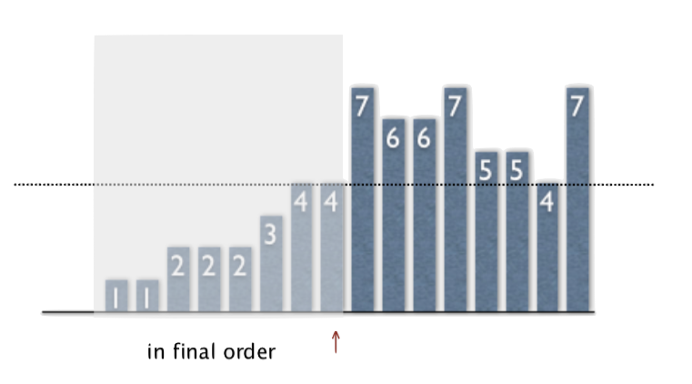

The pointer scans from left to right.

***Invariants***:

- Entries the left of pointer fixed and in ***ascending order***
- No entry to right of pointer is smaller than any entry to the left of pointer

### Inner Loop

To maintain algorithm invariants:

- Move the pointer to the right:

  ```java
  i++
  ```

  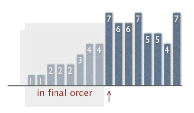

- Identify index of minimum entry on right

  ```java
  int min = i;
  for (int j = i+1; j < N; j++) {
      if (less(a[j],a[min])) {
          min = j;
      }
  }
  ```

  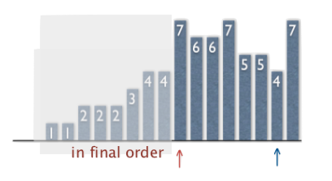

- Exchange into position

  ```java
  exch(a,i,min);
  ```

  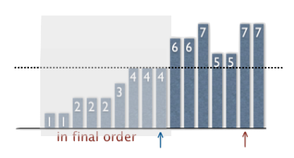

### Java Implementation

```java
public class Selection {
    public static void sort(Comparable[] a) {
        int N = a.length;
        for (int i = 0l i < N; i++) {
            int min = i;
            for (int j = i+1; j < N; j++) {
                if (less(a[j],a[min])) {
                    min = j;
                }
            }
            exch(a,i,min);
        }
    }
    
    private static boolean less(Comparable v, Comparable w) {
        /* as before */
    }
    
    private static void exch(Comparable[] a, int i, int j) {
        /* as before */
    }
}
```

### Mathematical Analysis

***Proposition***: Selection sort uses $(N-1) + (N-2) + \dots + 1 + 0 \sim \frac{N^2}{2}$ compares and $N$ exchanges

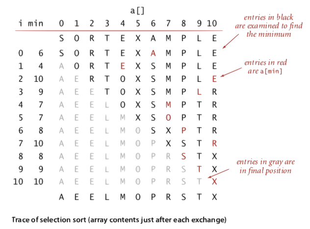

***Running Time***:

- quadratic time
- running time is insensitive to input
- even if input is partially- or fully-sorted

***Data Movement:***

- linear number of exchanges
- data movement is minimal

## Insertion Sort

In iteration $i$, swap `a[i]` with each larger entry to its left

[Animations](http://www.sorting-algorithms.com/insertion-sort)

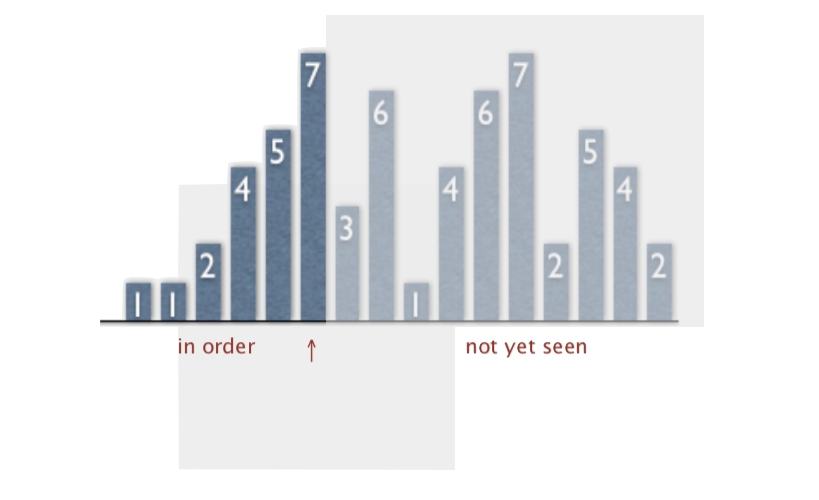

Pointer scans from left to right.

***Invariants***:

- entries to the left of pointer (including pointer) are in ***ascending order***
- entries to the right of pointer have not yet been seen

### Inner Loop

To maintain algorithm invariants:

- Move the pointer to the right

  ```java
  i++;
  ```

  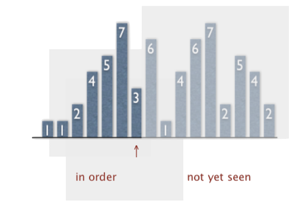

- Moving from right to left, exchange `a[i]` with each larger entry to its left

  ```java
  for (int j = i; j > 0; j--) {
      if (less(a[j],a[j-1])) {
          exch(a,j,j-1);
      } else break;
  }
  ```

  

### Java Implementation

```java
public class Insertion {
    public static void sort(Comparable[] a) {
        int N  = a.length;
        for (int i = 0; i < N; i++) {
            for (int j = i; j > 0; j--) {
                if (less(a[j],a[j-1])) {
                    exch(a,j,j-1);
                } else break;
            }
        }
    }
    
    private static boolean less(Comparable v, Comparable w) {
        /* as before */
    }
    
    private static void exch(Comparable[] a, int i, int j) {
        /* as before */
    }
}
```

### Mathematical Analysis

***Proposition***: to sort a randomly-ordered array with distinct keys, insertion sort uses $\sim \frac{N^2}{4}$ compares and $\sim \frac{N^2}{4}$ exchanegs on average

***Proof***: expect each entry to move halfway back on average:

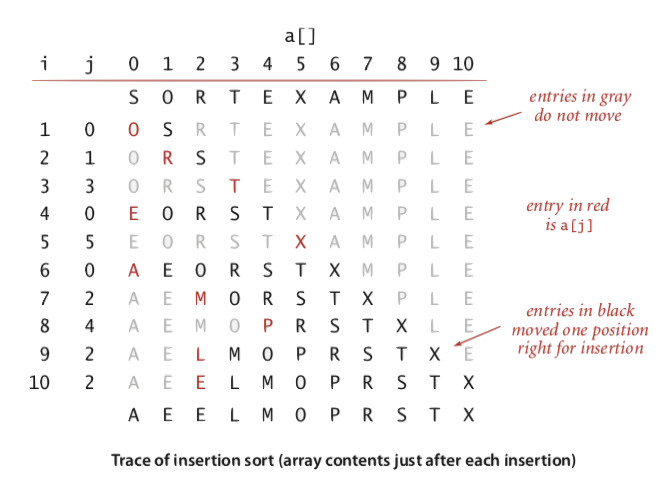

> ***Note that***:
>
> Each entry moves halfway back on average, which means half of the entries are expected to be black below the diagonal. There are $\frac{N^2}{2}$ entries below the diagonal and the half of that is $\frac{N^2}{4}$

#### Trace

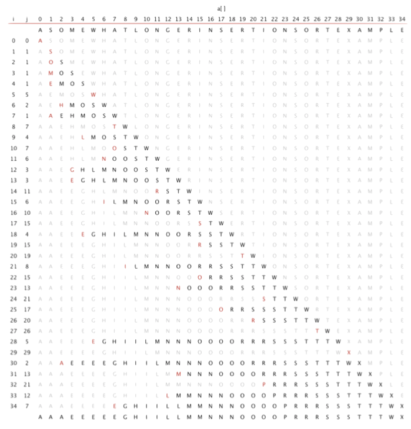

#### Best Case

If the array is in ***ascending order***, insertion sort makes $N-1$ comapres and $0$ exchanges

> ***Note that***:
>
> In this case the compares are just a validation on the ascending order

#### Worst Case

If the array is in ***descending order*** (and no duplicates), insertion sort makes $\sim \frac{N^2}{2}$ compares and $\sim \frac{N^2}{2}$ exchanges

#### Partially-Sorted Array

***Define***: an array is partially sorted if the number of inversions is $\le cN$

> ***Inversion***:
>
> An ***inversion*** is a pair of keys that are out of order
>
> *For instance:*
> $$
> A\, E \, E \, L \, M \, O \, T \, R \, X \, P \, S
> $$
> There are 6 inversions:
> $$
> T-R \\
> T-P \\
> T-S \\
> R-P \\
> X-P \\
> X-S
> $$

**Examples**:

- A subarray of size 10 appended to a sorted subarray of size $N$
- An array of size $N$ with only 10 entries out of place

***Proposition***: for partially-sorted arrays, insertion sort runs in ***linear time***

***Proof***:

- Number of exchanges equals the number of inversions
- Number of compares equals the number of exchanges plus $ (N-1)$

## Shellsort

***Idea***:

Move entries more than one position at a time by ***$h$-sorting*** the array.

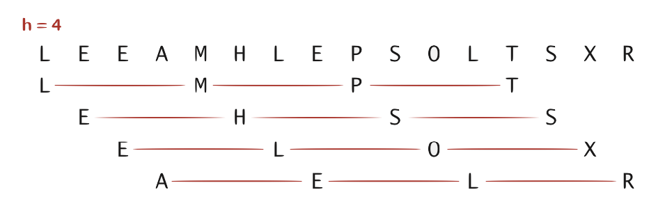

> ***$h$-Sorted Array***:
>
> An $h$-sorted array is $h$ interleaved sorted subsequences

***Shellsort***:

$h$-sort array for ***decreasing sequence*** of values of $h$

[Animation](http://www.sorting-algorithms.com/shell-sort)

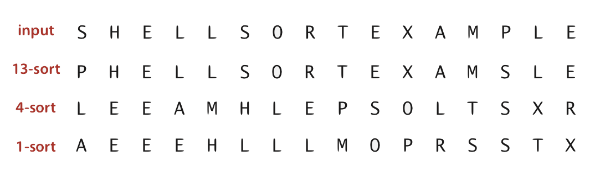

### $h$-Sorting

***Questions:***

How to $h$-sort an array?

***Answer:***

Insertion sort, with ***stride length*** $h$

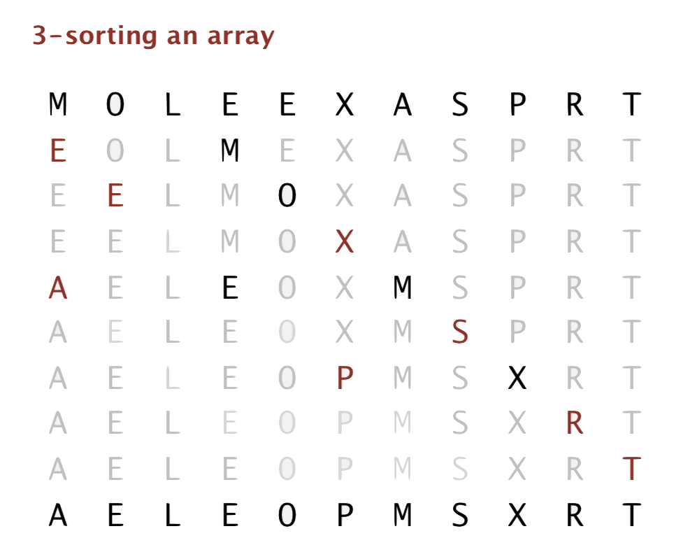

> ***Why Insertion Sort?***
>
> - For big increments, the subarrays will be small, which means any sorting algorithms would work well
> - For small increments after those big ones, the array will be partially sorted, which means the insertion sort will perform well 

### Example: Increments 7, 3, 1

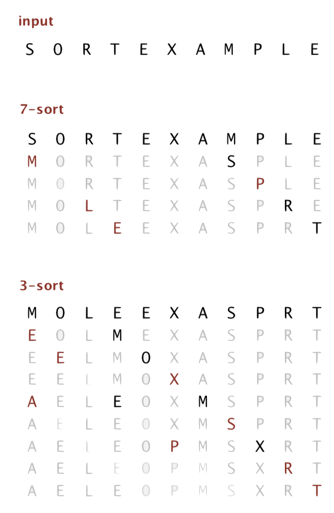

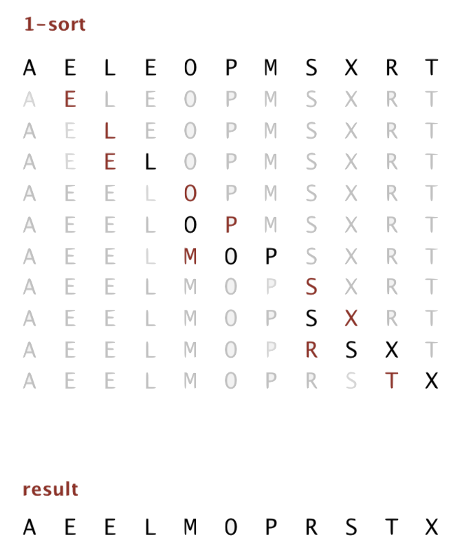

### Intuition

***Proposition***: a $g$-sorted array ***remains*** $g$-sorted after $h$-sorting it

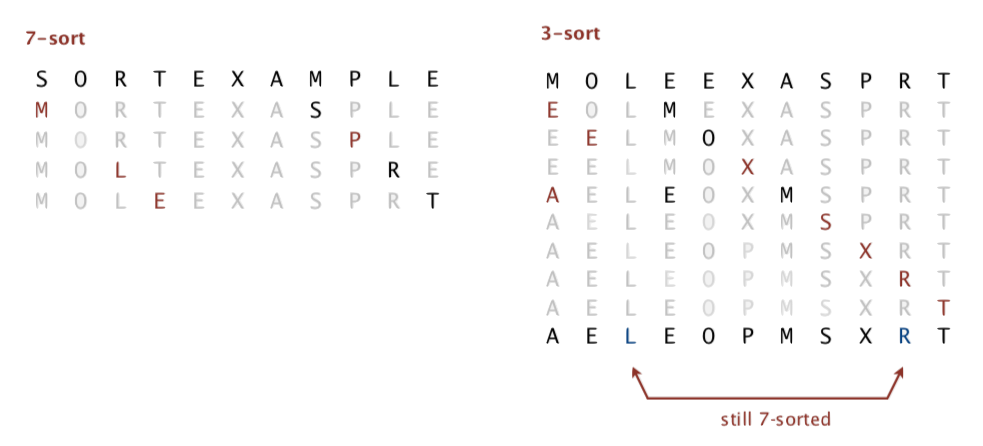

> ***Challenge***:
>
> It looks trivial to prove but it’s actually more subtle

### Increment Sequence

> ***Power of Two:***
> $$
> 1,2,4,8,16,32,\dots
> $$
> It will wind up not comparing the elements in even positions with those in odd positions until the $1$-sort. So the performance can be ***bad***.

> ***Power of Two Minus One*** [Shell]:
> $$
> 1,3,7,15,31,63,\dots
> $$
> It performes ***okay***.

> $3x+1$ [Knuth]:
> $$
> 1,4,13,40,121,364, \dots
> $$
> It works ***well*** and it is ***easy to compute***.

> ***Sedgewick’s Sequence*** [Sedgewick]:
> $$
> 1,5,19,41,109,209,505,929,2161,3905,\dots
> $$
> It’s ***good*** and ***tough to beat*** in empirical studies.

### Java Implementation

```java
public class Shell {
    public static void sort(Comparable[] a) {
        int N  = a.length;
        
        // 3x+1 increment  sequence
        int h = 1;
        while (h < N/3) {
            h = 3*h + 1; // 1, 4, 13, 40, 121, 364, ...
        }
        
        while (h >= 1) {
            // h-sort the array
            // insertion sort
            for (int i = h; i < N; i++) {
                for (int j = i; j >= h && less(a[j],a[j-h]); j -= h)
                    exch(a,j,j-h);
            }
            
            h = h/3; // move to next increment
        }
    }
    
    private static boolean less(Comparable v, Comparable w) {
        /* as before */
    }
    
    private static void exch(Comparable[] a, int i, int j) {
        /* as before */
    }
}
```

### Visual Trace

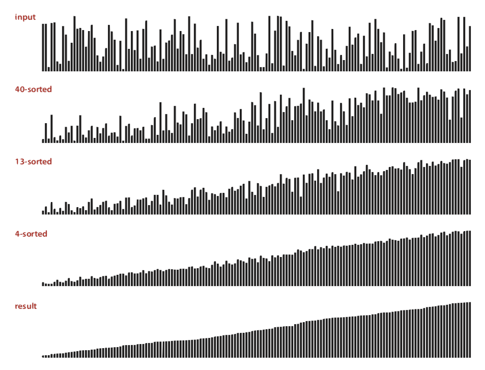

### Analysis

***Proposition***: the worst-case number of compares used by shellsort with the $3x+1$ increments is $O(N^{\frac{3}{2}})$

***Property***:

Number of compares used by shellsort with the $3x+1$ increments is at most by a small multiple of $N$ times the number of increments used.

| $N$    | compares | $N^{1.289}$ | $2.5 N \lg N$ |
| ------ | -------- | ----------- | ------------- |
| 5,000  | 93       | 58          | 106           |
| 10,000​ | 209      | 143         | 230           |
| 20,000​ | 467      | 349         | 495           |
| 40,000​ | 1022     | 855         | 1059          |
| 80,000​ | 2266     | 2089        | 2257          |

> measured in thousands

> ***Remark***:
>
> An accurate model has ***not yet*** been discovered

#### Sample Question

***Question***:

*How many compares does shellsort (using $3x+1$ increment sequence) make on an input array that is **already sorted**?*

***Answer***:

**Linearithmic**. Since successive increment values of $h$ differ by at least a factor of 3, there are $\sim \log_3N$ increment values. For each increment value $h$, the array is already $h$-sorted so it will make $\sim N$ compares (insertion sort). 

### Why Are We Interested In Shellsort?

It is an exmaple of ***simple idea leading to substantial performance gains***.

It’s useful in practice:

- Fast unless array size is huge (used for small subarrays: _bzip2_, _/linux/kernel/groups.c_)
- Tiny, fixed footprint for code (used in some embedded systems: _uClibc_)
- Hardware sort prototype

It’s a ***simple*** algorithm with yet ***non-trivial*** performance. That raises interesting questions:

- Asymptotic growth rate?
- Best sequence of increments?
- Average-case performace?

> ***Lesson***:
>
> Some good algorithms are still waiting discovery

## Shuffling

***Goal***: rearrange array so that result is a ***uniformly random permutation***.

### Shuffle Sort

- generate a random real number for each array entry
- sort the array

> ***Fun Fact***: 😲
>
> Useful for shuffling columns in a spreadsheet

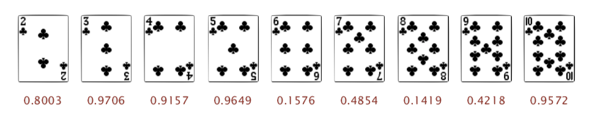

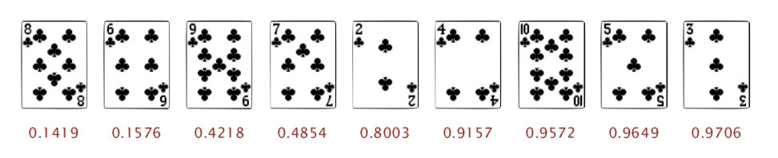

***Proposition***: shuffle sort produces a uniformly random permutation (assuming real number uniformly at random) of the input array, provided no duplicate values

### War Stroy: Microsoft

Microsoft antitrust probe by EU. Microsoft then agreed to provide a ***randomised ballot*** screen for users to select browser in Windows 7:


***Solution***:

Implement shuffle sort by making comparator ***always return a random answer***.

```java
public int compareTo(Browser that) {
    double r = Math.random();
    if (r < 0.5) return -1;
    if (r > 0.5) return +1;
    return 0
}
```

But _IE_ appeared last ***50%*** of the time.

### Knuth Shuffle

- In iteration $i$, pick integer $r$ between $0$ and $i$ uniformly at random.
- Swap `a[i]` and `a[r]`

#### Java Implementation

```java
public class StdRandom {
    ...
    public static void shuffle(Object[] a) {
        int N = a.length;
        for (int i = 0; i < N; i++) {
            int r = StdRandom.uniform(i + 1);
            exch(a,i,r);
        }
    }
}
```

> ***Note that***:
>
> - Common bug: pick between $0$ and $N-1$
> - Correct variant: pick between $i$ and $N-1$

***Proposition***: Knuth shuffling algorithm produces a uniformly random (assuming integers uniformly at random) permutation of the input array in linear time.

### War Story: Online Poker

[***How We Learned to Cheat at Online Poker: A Study in Software Security***](http://www.datamation.com/entdev/article.php/616221)

#### Algorithm with Bugs

```pseudocode
FOR i := 1 TO 52 DO BEGIN
	r := RANDOM(51) + 1 // between 1 and 51
	swap := card[r]
	card[r] := card[i]
	card[i] := swap;
END
```

> ***Bug #1***:
>
> Random number $r$ never $52$, so $52^{nd}$ card can’t end up in $52^{nd}$ place

>  ***Bug #2***:
>
> Shuffle not uniform, it should be between $1$ and $i$

> ***Bug #3***:
>
> `RANDOM()` uses $32$-bit seed, giving only $2^{32}$ possible shuffles

> ***Bug #4***:
>
> The seed is the milliseconds since midnight, which gives only 86.4 million shuffles

***Exploit***:

After **seeing 5 cards** and **synchronising with server clock,** you can get all the future cards in real time in a programme.

> *“The generation of random number is too important to be left to chance.”*
>
> [Rober R. Coveyou]

### Best Practice for Shuffling

- Use a ***hardware*** random-number generator that has passed both the FIPS 140-2 and the NIST statistical test suites
- Continuously monitor statistic properties: hardware random-number generators are fragile and fail silently
- Use an unbiased shufling algorithm

> ***Lesson of the Day:*** 💡
>
> Don’t think that it’s easy to shuffle a deck of cards

## Convex Hull

The ***convex hull*** of a set of $N$ points is the smallest primeter fence enclosing the points

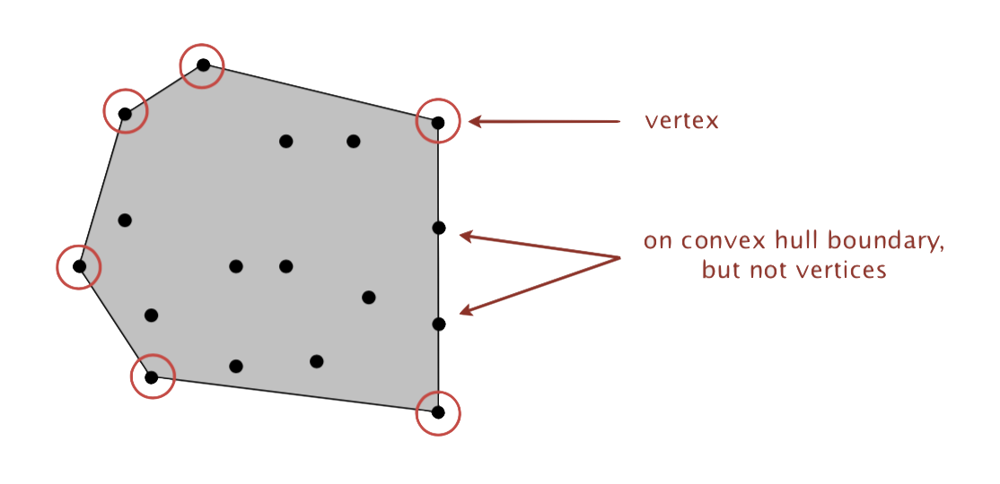

> ***Equivalent Definitions***:
>
> - Smallest convex set containing all the points
> - Smallest area convex polygon enclosing the points
> - Convex polygon enclosing the points, whose vertices are points in set

***Convex Hull Output***: sequence of vertices in **counterclockwise** order

### Application

#### Robot Motion Planning

Find shortest path in the plane from $s$ to $t$ that avoids a polygonal obstacle

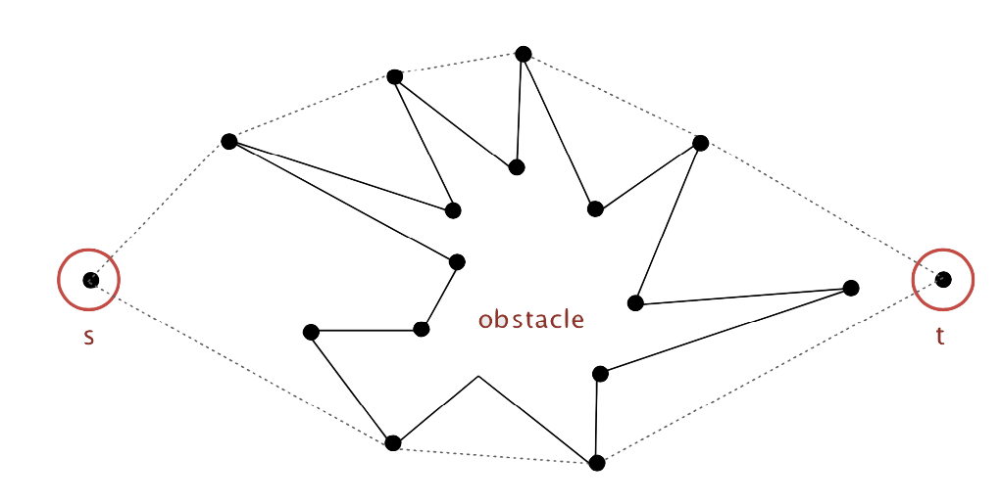

> ***Fact***:
>
> Shortest path is either straight line from $s$ to $t$ or it is one of two polygonal chains of convex hull

#### Furthest Pair

Given $N$ pointers in the plane, find a pair of points with the largest Euclidean distance between them

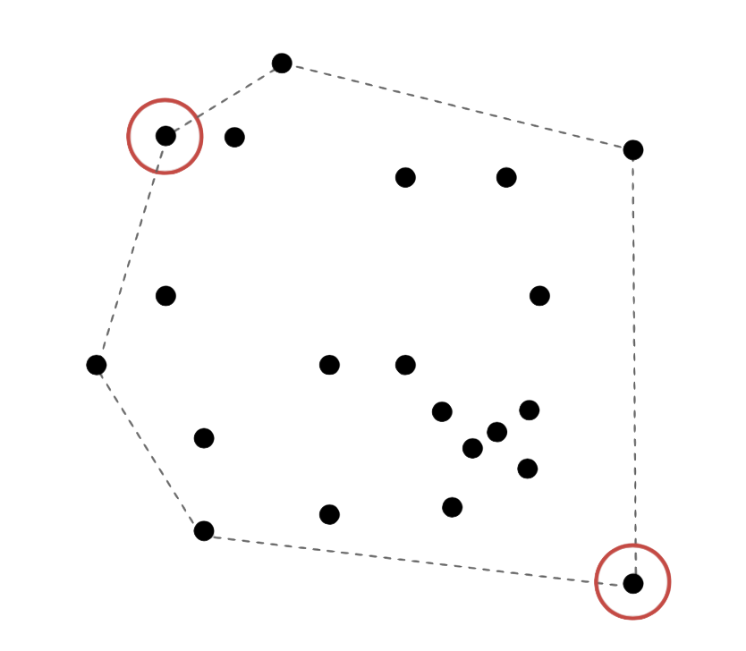

> ***Fact***:
>
> Furthest pair of points are **extreme points** on convex hull

### Geometric Properties

> ***Fact***:
>
> Can traverse the convex hull by making ***only*** counterclockwise turns

> ***Fact***:
>
> The vertices of convex hull appear in increasing order of polar angle with respect to point $p$ with lowest $y$-coordinate

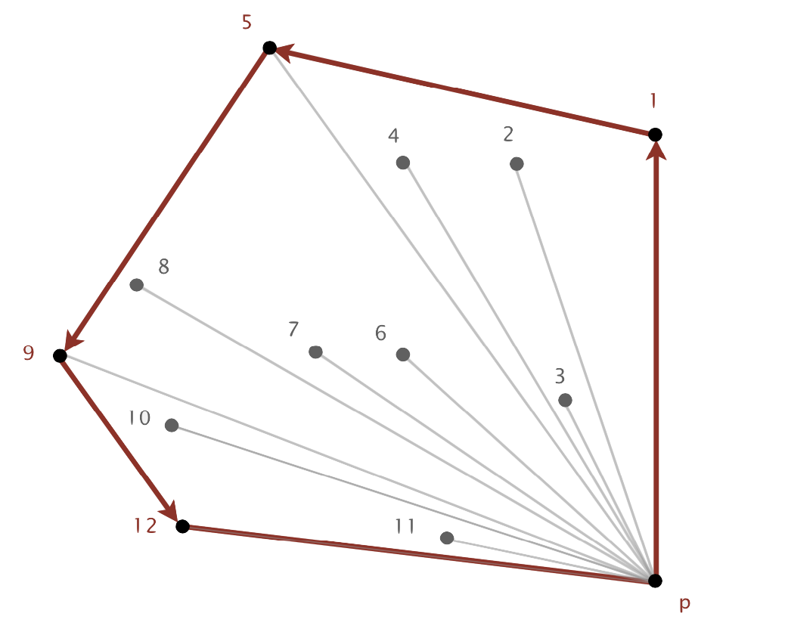

### Gramham Scan

- choose point $p$ with smallest $y$-coordinate
- ***sort*** points by polar angle with $p$
- consider points in order; discard unless it create a counterclockwise turn

#### Implementation Challenges

***Question***: *How to find point $p$ with smllest $y$-coordinate?*

***Answer*** : Define a total order, comparing by $y$-coordinate.

***Question*** : *How to sort points by polar angle with respect to $p$?*

***Answer***: Define a total order for each point $p$

***Question*** : *How to determine whether $p_1 \to p_2 \to p_3$ is a counterclockwise turn?*

***Answer*** : Computational Geometry

***Question***: *How to sort efficiently?*

***Answer***: Mergesort sorts in $N \log N$ times

***Question***: *How to handle degeneracies (three or more points on a line)?*

***Answer***: Requires some care, but not hard

#### Implementing _Counterclockwise_

***Decoded Question***:

In sequence $a \to b \to c$, is $c$ to the ***left*** of the ray $a \to b$?

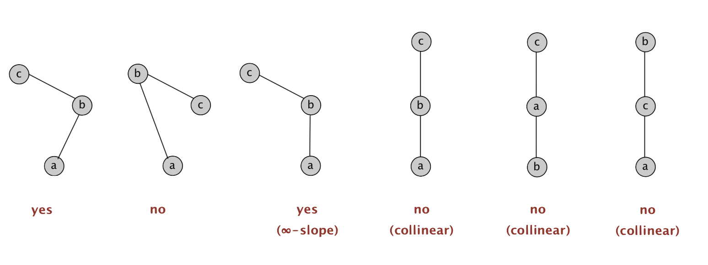

> Lesson:
>
> Geometric primitives are tricky to implement
>
> - Dealing with degenerate cases
> - Coping with floating-point precision

***Linear Algebra Hint***:

***Determinant*** (or ***cross product***) gives 2 $\times$ signed area of planar triangle
$$
2 \times Area(a,b,c) = 
\begin{vmatrix}
a_x & a_y & 1 \\
b_x & b_y & 1 \\
c_x & c_y & 1 \\
\end{vmatrix}
 = (b_x - a_x)(c_y-a_y) - (b_y-a_y)(c_x-a_x)
$$

- If signed area $\gt 0$, then $a \to b\to c$ is **counterclockwise**
- If signed area $\lt 0$, then $a \to b\to c$ is **clockwise**
- If signed area $= 0$, then $a \to b\to c$ are **collinear**

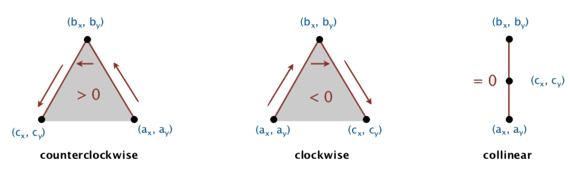

### _Immutable Point_ Data Type

```java
public class Point2D {
    private final double x;
    private final double y;
    
    public Point2D(double x, double y) {
        this.x = x;
        this.y = y;
    }
    
    ...
        
    public static int ccw(Point2D a, Point2D b, Point2D c) {
        double area2 = (b.x - a.x)*(c.y - a.y) - (b.y - a.y)*(c.x - a.x);
        if (area2 < 0) return -1; // clockwise
        else if (area > 0) return 1; // counterclockwise
        else return 0; // collinear
    }
}
```

