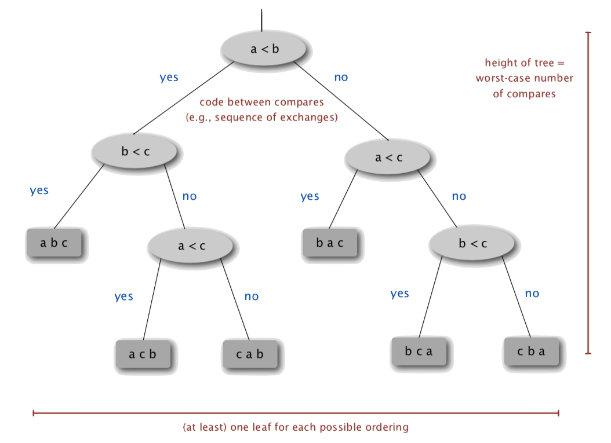

# Lecture 5: Mergesort

[toc]

## Top-Down Mergesort

- _Java_ sort for _objects_
- _Perl_, _C++_ stable sort, _Python_ stable sort, _Firefox JavaScript_, ...

### Basic Plan

- Divide array into two halves
- ***Recursively*** sort each half
- Merge two halves

[Animations](http://www.sorting-algorithms.com/merge-sort)


### Abstract In-Place Merge

Goal: given two sorted subarrays `a[lo]` to `a[mid]` and `a[mid+1]` to `a[hi]`, replace with sorted subarray `a[lo]` to `a[hi]`.


- make a copy of `a[]` to an ***auxiliary array*** `aux[]`
- maintain 3 indices:
  - `i` as the entry for the left subarray of `aux[]`
  - `j` as the entry for the right subarray of `aux[]`
  - `k` as the entry for `a[]`
- compare `aux[i]` with `aux[j]`, put whichever that is smaller to `a[k]`
- if `aux[i]` equals `aux[j]`, put `aux[i]` to `a[k]`
- if any subarray eliminated, put the remainder of the other subarray to the remainder of `a[]`
- increment whichever index that points at the moved element, and `k` 

```java
private static void merge(Comparable[] a, Comparable[] aux, int lo, int mid, int hi) {
    assert isSorted(a,lo,mid); // precondition: a[lo..mid] sorted
    assert isSorted(a,mid+1,hi); // precondition: a[mid+1..hi] sorted
    
    // copy
    for (int k = lo; k <= hi; k++) {
        aux[k] = a[k];
    }
    
    // merge
    int i = lo, j = mid+1;
    for (int k = lo; k <= hi; k++) {
        if (i > mid) a[k] = aux[j++];
        else if (j > hi) a[k] = aux[i++];
        else if (less(aux[j],aux[i])) a[k] = aux[j++];
        else a[k] = aux[i++];
    }
    
    assert isSorted(a,lo,hi); // postcondition: a[lo..hi] sorted
    
}
```

> ***Assertion***:
>
> Statement to test assumptions about your program.
>
> - helps detect logic bugs
> - documents code
>
> ***Java `assert` Statement:***
>
> Throws _Exception_ unless boolean condition is `true`
>
> ```java
> assert isSorted(a,lo,hi);
> ```
>
> ***Runtime:***
>
> ```shell
> java -ea MyProgram # enable assertions
> java -da MyProgram # disable assertions (default)
> ```
>
> So no cost in production code.
>
> ***Best Practices***:
>
> - use assertions to check internal invariants
> - assume assertions will be disabled in production code - <u>do not use for external argument checking</u>

### Java Implementation

```java
public class Merge {
    private static void merge(...) {
        /* as before */
    }
    
    private static void sort(Comparable[] a, Comparable[] aux, int lo, int hi) {
        if (hi <= lo) return; // base case
        int mid = lo + (hi - lo) / 2;
        sort(a,aux,lo,mid); // recursive case: sort the first half
        sort(a,aux,mid+1,hi); // recursive case: sort the other half
        merge(a,aux,lo,mid,hi);
    }
    
    // interface
    public static void sort(Comparable[] a) {
        aux = new Comparable[a.length];
        sort(a,aux,0,a.length-1);
    }
}
```

### Trace


### Running Time Analysis

***Proposition***: mergesort uses at most $N\lg N$ compares and $6N \lg N$ array accesses to sort any array of size $N$

***Proof Sketch***:

The number of compares $C(N)$ and array accesses $A(N)$ to mergesort an array of size $N$ satisfy the recurrences:
$$
C(N) \le C([\frac{N}{2}]) + C([\frac{N}2]) + N
$$
for $N \gt 1$, wirh $C(1) = 0$

> ***Note that***:
>
> The $N$ item in the polynomial is the maximal number of compares to merge, happens when neither of the two halves exhaust.

$$
A(N) \le A([\frac{N}{2}]) + A([\frac{N}2]) + 6N
$$

for $N \gt 1$, wirh $C(1) = 0$

> ***Note that***:
>
> The $6N$ item in  the polynomial is the maximal number of array accesses to merge.

Solve the recurrence when $N$ is a power of $2$. The result holds for all $N$
$$
D(N) = 2D(\frac{N}{2}) + N
$$
for $N \gt 1$, with $D(1) = 0$

***Proposition***: if $D(N)$ satisfies $D(N) = 2D(\frac{N}{2}) + N$ for $N \gt 1$, with $D(1) = 0$, then $D(N) = N \lg N$.

#### Proof By Picture


The ***depth*** is the *number of times you divide $N$ to take it down to $2$., which is $\lg N$.

> Assuming $N$ is a power of $2$

#### Proof By Expansion

$$
\begin{aligned}
D(N) &= 2D(\frac{N}{2}) +N \\
\frac{D(N)}N &= \frac{2D(\frac{N}{2})}N +1 \\
&= \frac{D(\frac{N}{2})}{\frac{N}{2}}+1 \\
&= \frac{D(\frac{N}{4})}{\frac{N}{4}}+1 +1 \\
&= \frac{D(\frac{N}{8})}{\frac{N}{8}}+1 +1 +1 \\
& \dots \\
&= \frac{D(\frac{N}{N})}{\frac{N}{N}}+1 +1 + \dots +1 \\
&= \lg N
\end{aligned}
$$

#### Proof By Induction

- ***Base case***: $N =1$
- ***Inductive hypothesis***: $D(N) = N \lg N$
- ***Goal***: show that $D(2N) = (2N) \lg (2N)$

$$
\begin{aligned}
D(2N) &= 2D(N) +2N \\
&= 2N \lg N + 2N \\
&= 2N(\lg (2N) -1) +2N \\
&= (2N) \lg (2N)
\end{aligned}
$$

### Memory Analysis

***Proposition***: Mergesort uses extra space proportional to $N$

***Proof***:

The array `aux[]` needs to be of size $N$ for the last merge


> ***In-Place***:
>
> A sorting algorithm is ***in-place*** if it uses $\le c \log N$ extra memory.
>
> **Examples**: insertion sort, selection sort, shellsort

> ***Fun Fact***:
>
> There are methods for in-place merge but they are relatively too complex to be used in practice. But it’s possible that there is a perfect solution out there waiting for dicovery.

### Practical Improvements

#### Small Subarrays

Mergesort has too much overhead for tiny subarrays. The recursive nature means that there are going to be lots of subarrays to be sorted.

***Solution***: ***Cutoff*** to insertion sort for subarrays with $\approx 7$ items

```java
private static void sort(Comparable[] a, Comparable[] aux, int lo, int hi) {
    // test for cutoff
    if (hi <= lo + CUTOFF - 1) {
        Insertion.sort(a,lo,hi);
        return
    }
    
    // original mergesort
    int mid = lo + (hi - lo) / 2;
    sort(a,aux,lo,mid); 
    sort(a,aux,mid+1,hi); 
    merge(a,aux,lo,mid,hi);
}
```

#### Sorted Array

***Stop*** if the array is already sorted.

***Test for if the array is sorted or not***:

- Is the biggest item in the first half $\le$ smallest item in the second half?
- helps for partially-ordered arrays


```java
private static void sort(Comparable[] a, Comparable[] aux, int lo, int hi) {
    if (hi <= lo) return;
    int mid = lo + (hi - lo) / 2;
    sort(a,aux,lo,mid); 
    sort(a,aux,mid+1,hi); 
    if (!less(a[mid+1],a[mid])) return; // check
    merge(a,aux,lo,mid,hi);
}
```

#### Auxiliary Array

Eliminate the ***copy*** to the auxiliary array, which saves time but not space, by switching the role of the input and auxiliary array in each recursive call. *(Sort an array and put the result in the other)*

```java 
private static void merge(Comparable[] a, Comparable[] aux, int lo, int mid, int hi) {
    int i = lo, j = mid + 1;
    for (int k = lo; k <= hi; k++) {
        // merge from a[] to aux[]
        if (j > mid) aux[k] = a[j++];
        else if (j > hi) aux[k] = a[i++];
        else if (less(a[j],a[i])) aux[k] = a[j++];
        else aux[k] = a[i++];
    }
}

private static void sort(Comparable[] a, Comparable[] aux, int lo, int hi) {
    if (hi <= lo) return;
    int mid = lo + (hi - lo) / 2;
    // switch roles of aux[] and a[]
    sort(aux,a,lo,mid); 
    sort(aux,a,mid+1,hi); 
    merge(a,aux,lo,mid,hi);    
    /* Note that:
     * sort(a) initialises aux[] ans sets aux[i] = a[i] for each i 
     */
}
```

### Visualisation


## Buttom-Up Mergesort

### Basic Plan

- Pass through array, merging subarrays of size $1$
- Repeat for subarrays of size $2,4,8,16,\dots$


### Java Implementation

```java
public class MergeBU {
    private static void merge(...) {
        /* as before */
    }
    
    public static void sort(Comparable[] a) {
        int N = a.length;
        Comparable[] aux = new Comparable[N];
        for (int sz = 1; sz < N; sz = sz+sz)
            for (int lo = 0; lo < N-sz; lo += sz+sz)
                merge(a,aux,lo,lo+sz-1,Math.min(lo+sz+sz-1,N-1));
        		/* Math.min() is for the case when
        		 * a remainder of a[] can't be covered by sz
        		 */
    }
}
```

> ***Note that***:
>
> It’s a simple and non-recursive version of mergesort. But about 10% slower than recursive, top-down mergesort on typical systems

### Trace


## Sorting Complexity

For a sorting problem:

| Parameters           | Argument                                                     |
| -------------------- | ------------------------------------------------------------ |
| Model of Computation | Decision tree - *can access information only through compares (e.g. Java `Comparable` framework )* |
| Cost Model           | Number of compares                                           |
| Upper Bound          | $\sim N \lg N$ from **mergesort**                            |
| Lower Bound          | ?                                                            |
| Optimal Algorithm    | ?                                                            |

> ***Computational Complexity***:
>
> ***Framework*** to study ***efficiency*** of algorithms for solving a particular problem $X$.
>
> | Parameters           | Meaning                                                      |
> | -------------------- | ------------------------------------------------------------ |
> | Model of Computation | Allowable **operations**                                     |
> | Cost Model           | Operation count(s)                                           |
> | Upper Bound          | Cost guarantee provided by **some** algorithms of $X$        |
> | Lower Bound          | Proven limit on cost guarantee of **all** algorithms of $X$  |
> | Optimal Algorithm    | Algorithm with best (lower bound ~ upper bound) possible cost guarantee for $X$ |

### Decision Tree

For 3 distinct item $a,b,c$



### Compared-Based Lower Bound

***Proposition***: Any compare-based sorting algorithms must use at least $\lg (N!) \sim N\lg N$ compares in the worst-case.

Proof:

- assume array consists of $N$ distinct values $a_1$ through $a_N$. 
- worst case dictated by **height** $h$ of decision tree
- binary tree of height $h$ has at most $2^h$ leaves
- $N!$ different ordering so at least $N!$ leaves

By using ***Stirling’s*** formula
$$
2^h \ge \# leaves \ge N! \to h \ge \lg (N!) \sim N\lg N
$$
So the sorting complexity:

| Parameters           | Argument                                                     |
| -------------------- | ------------------------------------------------------------ |
| Model of Computation | Decision tree - *can access information only through compares (e.g. Java `Comparable` framework )* |
| Cost Model           | Number of compares                                           |
| Upper Bound          | $\sim N \lg N$ from **mergesort**                            |
| Lower Bound          | $\sim N \lg N$                                               |
| Optimal Algorithm    | ***mergesort***                                              |

### Complexity Result In Real Context

Mergesort is ***optimal*** with respect to numer of compares but it is ***not optimal*** with respect to space usage.

> ***Lesson***:
>
> Use theory as a guide
>
> **Example**: don’t try to design sorting algorithm that guarantees $\frac{1}{2} N \lg N$ compares, since the lower bound says no.
>
> **Example**: it might be possible to design a sorting algorithm with $\sim N \lg N$ compares and optimal space usage.

### Limitation on Lower Bound Analysis

Lower bound may not hold if the algorithm has information about:

- the initial order of the input
- the distribution of key values
- the representation of the keys

#### Partially-Ordered Arrays

Depending on the ***initial order*** of the input, we might not need $N \lg N$ compares as insertion sort only requires $N-1$ compares if input array is sorted.

#### Duplicate Keys

Depending on the input distribution of dupliactes, we may not need $N \lg N$ compares

(Stay tuned for _3-Way Quicksort_)

#### Digital Properties of Keys

We can use digit/charater compares instead of key compares for numbers and strings.

(Stay tuned for _Radix Sorts_)

## Comparators

A compelling reason why use `Comparator` _interface_ rather than `Comparable` _interface_ is that `Comparator` supports multiple ordering of a given data type.

### `Comparator` _Interface_

Sort using an alternative order.

```java
public interface Comparator<Item> {
    public int compare(Key v, Key w)
}
```

***Required property***: must be a total order


### System Sort

To use with _Java_ system `sort()`:

- create `Comparator` _object_
- pass as second argument to `Arrays.sort()`

```java
String[] a;
...
Arrays.sort(a); // uses natural order
...
// uses alternate order defined by Comparator<String> object
Arrays.sort(a, String.CASE_INSENSITIVE_ORDER);
...
Arrays.sort(a, Collator.getInstance(new Locale("es")));
...
Arrays.sort(a, new BritishPhoneBookOrder())
```

> ***Note that***:
>
> `Comparator` decouples the definition of the data type from the definition of what it means to compare two objects of that type.

### Customised Sorting

To support `Comparator` in our sort implementation

- use `Object` instead of `Comparable`
- pass `Comparator` to `sort()` and `less()` and use it in `less()`

#### Insertion Sort using `Comparator`: Java Implementation

```java
public static void sort(Object[] a, Comparator comparator) {
    int N = a.length;
    for (int i = 0; i < N; i++) {
        for (int j = i; j > 0 && less(comparator, a[j], a[j-1]); j--)
            exch(a,j,j-1);
    }
}

private static boolean less(Comparator c, Object v, Object w) {
    return c.compare(v,w) < 0;
}

private static void exch(Object[] a, int i, int j) {
    Object swap = a[i];
    a[i] = a[j];
    a[j] = swap;
}
```

### Implementing `Comparator` _Interface_

To implement a `Comparator`

- define a (nested) class that implements the `Comparator` _interface_
- implement the `compare()` method

```java
public class Student {
    public static final Comparator<Student> BY_NAME = new ByName();
    public static final Comparator<Student> BY_SECTION = new BySection();
    
    ...
    private static class ByName implements Comparator<Student> {
        public int compare(Student v, Student w) {
            return v.name.compareTo(w.name);
        }
    }
    
    private static class BySection implements Comparatoe<Student> {
        public int compare(Student v, Student w) {
            return v.section - w.section;
            // this technique works here since no danger of overflow
        }
    }
}
```


### Polar Order

Given a point $p$, order points by polar angle they make with $p$


***Application***: ***Graham Scan*** algorithm for convex hull

#### Trigonometric Solution

Compute polar angle $\theta$ with respect to $p$ using `atan2()`

***Drawback***: evaluating a trigonometric function is expensive

#### Counterclockwise-Based Solution

- if $q_1$ is above $p$ and $q_2$ is below $p$, then $q_1$ makes smaller polar angle
- if $q_1$ is below $p$ and $q_2$ is above $p$, then $q_1$ makes larger polar angle
- otherwise, $ccw(p,q_1,q_2)$ identifies which of $q_1$ or $q_2$ makes larger angle

```java
public class Point2D {
    public final Comparator<Point2D> POLAR_ORDER = new PolarOrder();
    private final double x,y;
    ...
    private static int ccw(Point2D a, Point2D b, Point2D c) {
        /* as in previous lecture */
    }
    
    private class PolarOrder implements Comparator<Pointer2D> {
        public int compare(Point2D q1, Point2D q2) {
            double dy1 = q1.y - y;
            double dy2 = q2.y - y;
            
            if (dy1 == 0 && dy2 == 0) { ... } // p,q1,q2 horizontal
            else if (dy1 >= 0 && dy2 < 0) return -1; // q1 above p; q2 below p
            else if (dy2 >= 0 && dy 1 <0) return +1; // q1 below p; q2 above p
            else return -ccw(Point2D.this, q1, q2); 
            // Point2D.this accesses invoking point from within inner class
        }
    }
}
```

##  Stability

Sorting the students by _name_ and then by _section_


***Problem***: students in _section_ 3 no longer sorted by _name_

> ***Stability***:
>
> A ***stable*** sort preserves the relative order of items with equal keys

***Question***: which sorts are stable?

***Answer***: insertion sort and mergesort


> ***Note that***:
>
> Need to carefully check code (“less than” vs “less than or equal to")

### Stability of Insertion Sort

***Proposition***: Insertion sort is **stable**

```java
public class Insetion {
    public static void sort(Comparable[] a) {
        int N = a.length;
        for (int i = 0; i < N; i++)
            for (int j = i; j > 0 && less(a[j], a[j-1]); j--)
                exch(a,j,j-1)
    }
}
```

***Proof***:

Equal items never move past each other

### Stability of Selection Sort

***Proposition***: Selection sort is **not stable**

```java
public class Selection {
    public static void sort(Comparable[] a) {
        int N = a.length;
        for (int i = 0; i < N; i++) {
            int min = i;
            for (int j = i+1; j < N; j++)
                if (less(a[j], a[min]))
                    min = j;
            exch(a, i, min);
        }
	} 
}
```

***Disproof by Counter Example***

Long-distance exchange might move an item past some equal item


### Stability of Mergesort

***Proposition***: Mergesort is **stable**

```java
public class Merge {
    private static Comparable[] aux;
    private static void merge(Comparable[] a, int lo, int mid, int hi)
    {  /* as before */  }
    
    private static void sort(Comparable[] a, int lo, int hi) {
        if (hi <= lo) return;
        int mid = lo + (hi - lo) / 2;
        sort(a, lo, mid);
        sort(a, mid+1, hi);
        merge(a, lo, mid, hi);
    }
    
    public static void sort(Comparable[] a)
    {  /* as before */  }
}
```

***Proof***:

`merge()` operation is stable, it takes from left subarray if equal keys

```java
private static void merge(...) {
    for (int k = lo; k <= hi; k++)
        aux[k] = a[k];
    
    int i = lo, j = mid+1;
    for (int k = lo; k <= hi; k++)
    {
        if      (i > mid)              a[k] = aux[j++];
        else if (j > hi)               a[k] = aux[i++];
        else if (less(aux[j], aux[i])) a[k] = aux[j++];
        else                           a[k] = aux[i++];
    }
}
```


### Sample Question

***Question***: 

*Given an array of points, which approach would be least useful for removing duplicate points? Assume the point data type has the following three orders:*

- A natural order that compares by $x$-coordinate and breaks ties by $y$-coordinate.
- One comparator that compares by $x$-coordinate; another by $y$-coordiante.

*Note*: `quicksort` is an efficient, but *unstable*, sorting algorithm.

***Answer***:

**`Mergesort` by $x$-coordinate; `quicksort` by $y$-coordinate**

Since `quicksort` is not stable, if you `mergesort` by $x$*-coordinate and then quicksort by $y$-coordinate, there is no guarantee that equal points will be adjacent in the sorted order.