# Lecture 6: Quicksort

[toc]

## Quicksort

- _Java_ `sort` for primitive types
- _C_ qsort, _Unix_, _Visual C++_, _Python_, _Matlab_, _Chrome JavaScript_

[Animation](http://www.sorting-algorithms.com/quick-sort)

### Basic Plan

- ***shuffle*** the array
- ***partition*** so that, for some `j`:
  - entry `a[j]` is in place
  - no larger entry to the left of `j`
  - no smaller entry to the right of `j`
- ***sort*** each piece recursively

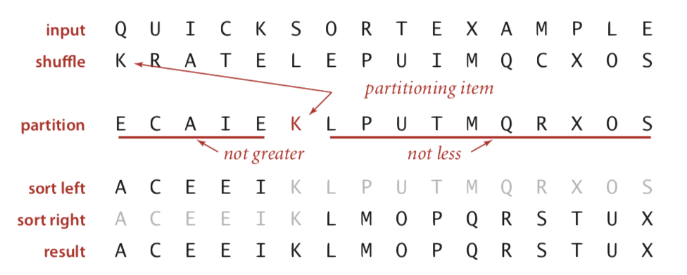

### Partitioning

- maintain two pointers `i` and `j`
- repeat until `i` and `j` cross
  - scan `i` from left to right so long as `a[i] < a[lo]`
  - scan `j` from right to left so long as `a[j] > a[lo]`
  - exchange `a[i]` with `a[j]`
- when pointers cross, exchange `a[lo]` with `a[j]`

***Before Partitioning***

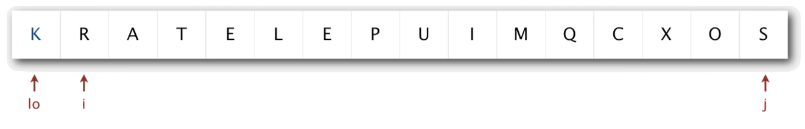

***After Partitioning***

*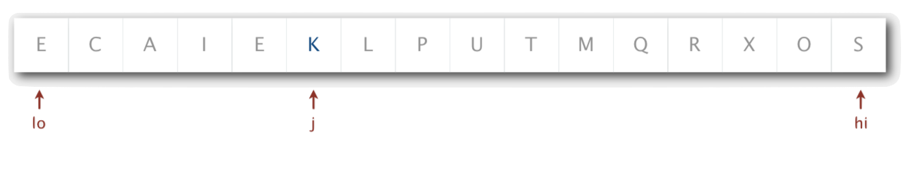*

```java
private static int partition(Comparable[] a, int lo, int hi) {
    int i = lo, j = hi+1;
    while (true) {
        /* find item on left to swap*/
        while (less(a[++i], a[lo]))
            if (i == hi) break;
        
        /* find item on right to swap*/
        while (less(a[lo], a[--j]))
            if (j == lo) break;
        
        if (i >= j) break; // check if pointers cross
        exch(a, i, j); // swap
    }
    
    exch(a, lo, j); // swap with partitioning item
    return j; // return index of item now known to be in place
}
```

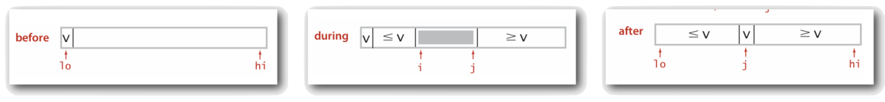

### Java Implementation

```java
public class Quick {
    private static int partition(Comparable[] a, int lo, int high) {
        /* see above */
    }
    
    public static void sort(Comparable[] a) {
        StdRandom.shuffle(a);
        sort(a, 0, a.length-1);
    }
    
    private static void sort(Comparable[] a, int lo, int hi) {
        if (hi <= lo) return;
        int j = partition(a, lo, hi);
        sort(a, lo, j-1);
        sort(a, j+1, hi);
    }
}
```

#### Implementation Details

> ***Partitioning In-Place:***
>
> Using an extra array makes partitioning easier (and stable), but is not worth the cost

> ***Terminating The Loop:***
>
> Testing whether the pointers cross is a bit trickier than it might seem

> ***Staying In Bounds:***
>
> The `(j == lo)` test is redundant, but the `(i == hi)` test is not

> ***Preserving Randomness:***
>
> Shuffling is needed for performance guarantee

> ***Equal Keys:***
>
> When duplicates are present, it is (*counter-intuitively*) better to stop on keys equal to the partitioning item’s key

### Trace

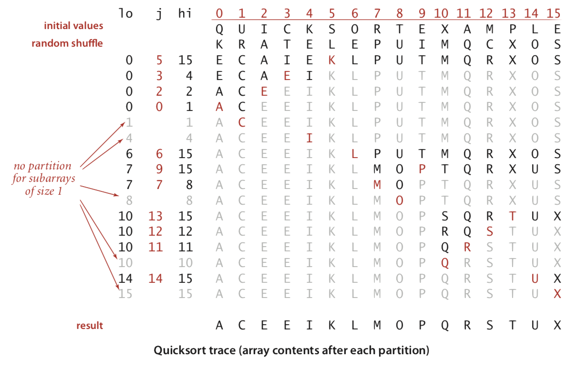

### Running Time Analysis

#### Best Case

Number of compares is $\sim N \lg N$

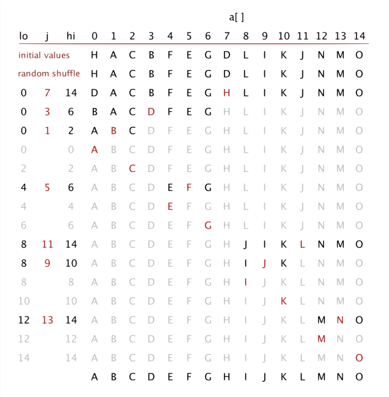

#### Worst Case

Number of compares is $\sim \frac{1}{2}N^2$

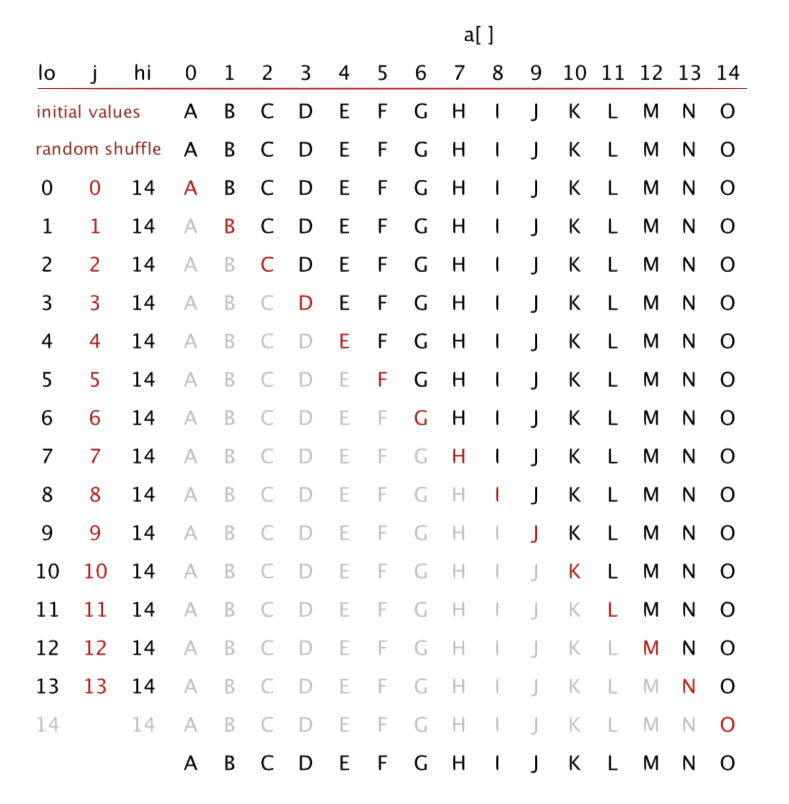

#### Average Case

***Proposition:*** The avarage number of comapres $C_N$ to quicksort an array of $N$ distinct keys is $\sim 2N \ln N$ (and the number of exchanges is $\sim \frac{1}{3}N\ln N$)

***Proof:***

$C_N$ statisfies the recurrence $C_0 = C_1 = 0$ and for $N \ge 2$:
$$
C_N = (N+1) + \frac{C_0 + C_{N-1}}{N}+ \frac{C_1 + C_{N-2}}{N} + \dots + \frac{C_{N-1} + C_{0}}{N}
$$

> Note that:
>
> - $(N+1)$ is the partitioning
> - $C_0 \dots C_{N-1}$ are the left subarrays
> - $C_{N-1} \dots C_0$ are the right subarrays
> - determinator $N$ is the partioning probability

Multiply both sides by $N$:
$$
NC_N = N(N + 1) + 2(C_0 + C_1 + \dots + C_{N-1})
$$
Subtract the same equation for $N-1$
$$
\begin{aligned}
(N-1)C_{N-1} &= N(N-2) + 2(C_0 + C_1 + \dots + C_{N-2}) \\
NC_N - (N-1)C_{N-1} &= N(N+1)- N(N-2) + 2C_{N_1} \\
&= 2N + 2C_{N-1}
\end{aligned}
$$
Rearrange terms and divide by $N(N+1)$
$$
\frac{C_N}{N+1} = \frac{C_{N-1}}{N} + \frac{2}{N+1}
$$
Repratedly apply above equation
$$
\begin{aligned}
\frac{C_N}{N+1} &= \frac{C_{N-1}}{N} + \frac{2}{N+1} \\
&= \frac{C_{N-2}}{N-1} +\frac{2}N + \frac{2}{N+1} \\
&= \frac{C_{N-3}}{N-2} + \frac2{N-1} +\frac{2}N + \frac{2}{N+1} \\
&= \frac{2}{3} + \frac24 + \frac25 + \dots + \frac2{N+1}
\end{aligned}
$$
Approximate sum by an integral
$$
\begin{aligned}
C_N &= 2(N+1) (\frac13 + \frac14 + \frac15 + \dots + \frac1{N+1}) \\
&\sim 2(N+1)\int_3^{N+1} \frac{1}x dx \\
&= 2(N+1)\ln N \approx1.39N \lg N
\end{aligned}
$$

#### Performance Characteristics

***Worst Case***: Number of comapres is quadratic

- $N+(N -1)+(N-2)+\dots +1 \sim \frac12N^2$
- less likely

***Average Case***: Number of compares is $\sim 1.39N \lg N$

- 39% more compares than mergesort
- but faster than mergesort in practice because of less data movement

***Random Shuffle***

- Probabilistic guarantee against worst case
- basis for math model that can be validated with experiments

***Caveat Emptor***: Many textbook implementations go quadratic if array

- is sorted or reverse sorted
- has many duplicates (even if randomised)

### Properties

#### In Place

***Propostition***: Quicksort is an in-place sorting algorithm

***Proof***:

- Partitioning: constant extra space
- Depth of recursion: logarithmic extra space (with high probability), can guarantee logarithmic depth by recurring on smaller subarray before larger subarray

#### Instability

***Proposition***: Quicksort is not stable

***Proof***:

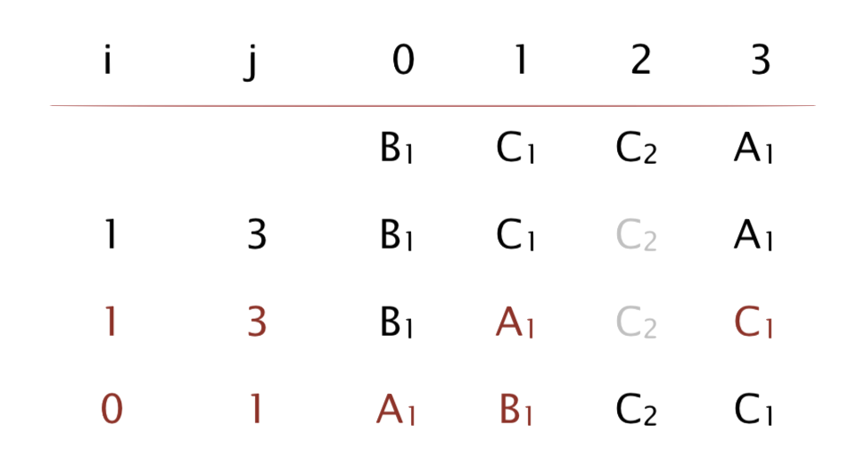

### Practical Improvement

#### Insertion Sort Small Subarrays

- even quicksort has too much overhead for tiny subarrays
- cutoff to insertion sort for $\approx 10$ items
- note: could delay insertion sort until one pass at end

```java
private static void sort(Comparable[] a, int lo, int hi) {
    if (hi <= lo + CUTOFF - 1) {
        Insertion.sort(a, lo, hi);
        return;
    }
    int j = partition(a, lo, hi) {
        sort(a, lo, j-1);
        sort(a, j+1, hi);
    }
}
```

#### Median of Sample

- best choice of pivot item is median
- estimate true median by taking median of sample
- Median-of-3 (random) items

```java
private static void sort(Comparable[] a, int lo, int hi) {
    if (hi <= lo) return;
    
    int m = medianOf3(a, lo, lo + (hi - lo)/2, hi);
    swap(a, lo, m);
    
    int j = partition(a, lo, hi);
    sort(a, lo, j-1);
    sort(a, j+1, hi);
}
```

#### Visualisation

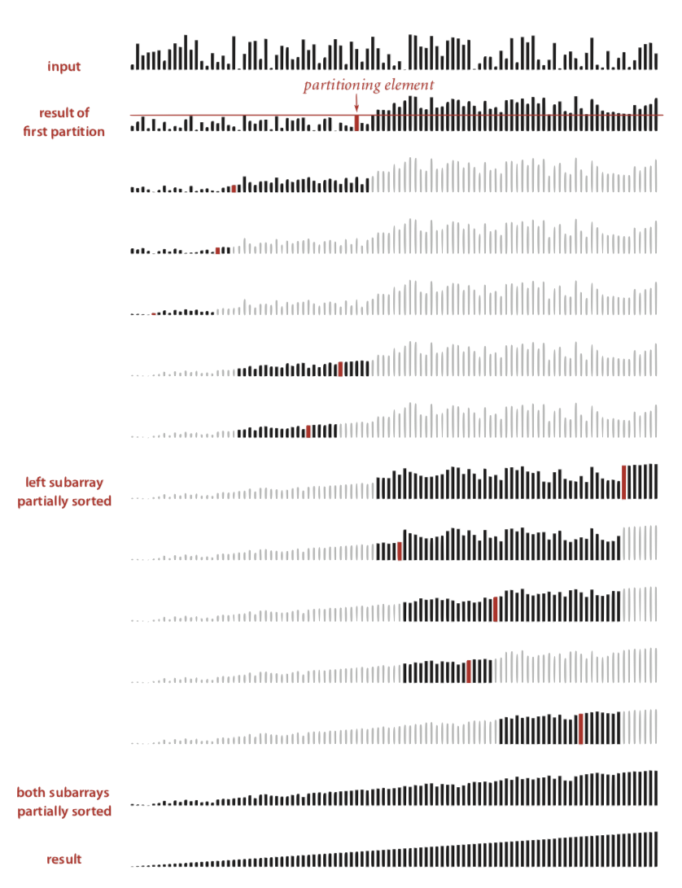

## Selection

***Goal***: Given an array of $N$ items, find a $k^{th}$ smallest item

***Theory***:

- Easy $N \lg N$ uppoer bound, by sorting the array in the first place
- Easy $kN$ upper bound for $k = 1, 2,3, \dots$, $k$ pass entry to the array
- Easy $N$ lower bound since all items have to be visited so that no item will be missed

***Question***: *is there a lieanr-time algorithm for each $k$?*

### Quick-Select

Partition array so that:

- entry `a[j]` is in place
- no larger entry to the left of `j`
- no smaller entry to the right of `j`

***Repeat*** in **one** subarray, depending on `j`, finished when `j` equals `k`

```java
public static Comparable select(Comparable[] a, int k) {
    StdRandom.shuffle(a);
    int lo = 0, hi = a.length - 1;
    while (hi > lo) {
        int j = partition(a, lo, hi);
        if (j < k) lo = j + 1;
        else if (j > k) hi = j - 1;
        else return a[k];
    }
    return a[k];
}
```

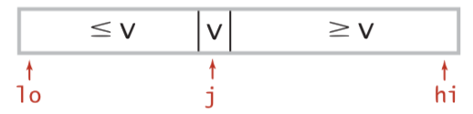

### Running Time Analysis

***Proposition***: Quick-select takes linear time on average

***Proof***:

- Intuitively, each partitioning step splits array approximately in half: $N + \frac N2 + \frac N4 + \dots + 1 \sim 2N$ compares

- Formal analysis similar to quicksort analysis yields:
  $$
  C_N = 2N + 2k \ln (\frac Nk) + 2(N-k)\ln \frac{N}{N-k}
  $$

> $(2+2\ln2)N$ to find the median

***Remark***:

Quick-select uses $\sim \frac 12 N^2$ compares in the ***worst case***, but (as with quicksort) the random shuffle provides a probabilistic guarantee

> ***Compared-Based Selection***:
> A compared-based selection algorithm has worst-case running which is linear *[Blum, Floyd, Pratt, Rivest, Tarjan, 1973]*
>
> **Remark**: but constants are too high, so the algorithm is not used in practice

> ***Lessons***:
>
> - Still worthwhile to seek practical linear-time (worst-case) algorithm.
>
> - Until one is discovered, use quick-select if you don’t need a full sort

## Duplicate Keys

***Mergesort with Duplicate Keys***:

Between $\frac 12 N \lg N$ and $N \lg N$ compares

***Quicksort wth Duplicate Keys***:

- algoirthm goes quadratic unless partitioning stops on equal keys
- 1990s C user found this defect in `qsort()`

### Problem

> ***Mistake***: put all items equal to the partitioining item on one side
>
> ***Consequence***: $\sim  \frac 12 N^2$ compares when all keys equal

> ***Recommanded***: stop scans on items equal to the partitioning item
>
> ***Consequences***: $\sim N \lg N$ compares when all keys equal

> ***Desirable***: put all items equal to the partitioning item in place

### 3-Way Partitioning

***Goal***: partition array into 3 parts so that:

- entries between `lt` and `gt` equal to partition item `v`
- no larger entries to left of `lt`
- no smaller entries to right of `gt`

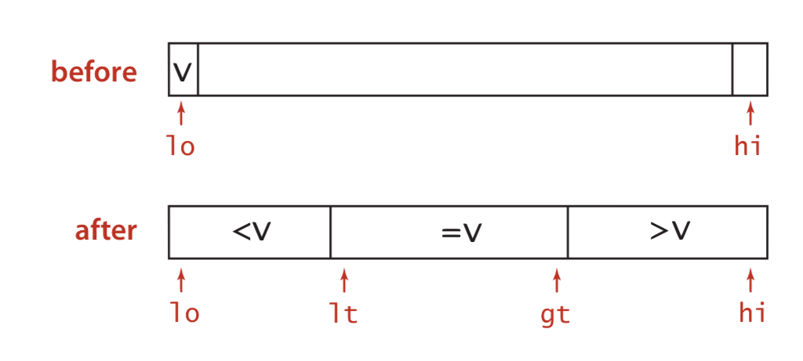

#### Dijkstra 3-Way Partitioning

- let `v` be partitioning item `a[lo]`
- scan `i` from left to right
  - `(a[i] < v)`: exchange `a[lt]` with `a[i]`; increment both `lt` and `i`
  - `(a[i] > v)`: exchange `a[gt]` with `a[i]`; decrement `gt`
  - `(a[i] == v)`: increment `i`

***Before***:

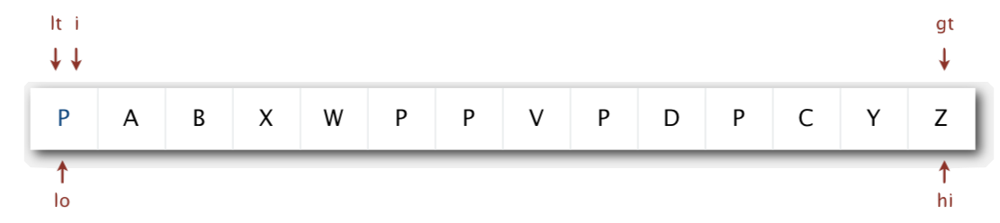

***After***:

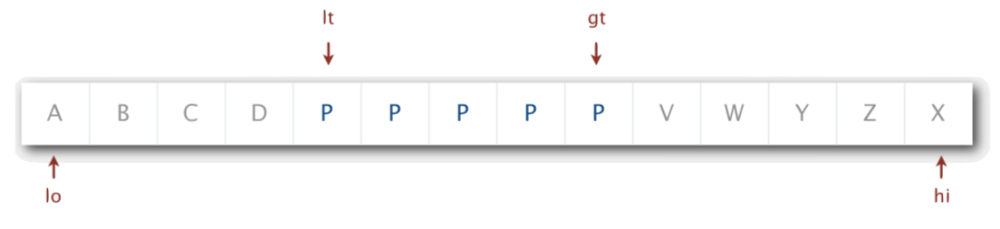

#### Java Implementation

```java
private static void sort(Comparable[] a, int lo, int hi) {
    if (hi <= lo) return;
    int lt = lo, gt  = hi;
    Comparable v = a[lo];
    int i = lo;
    while (i <= gt) {
        int cmp = a[i].compareTo(v);
        if (cmp < 0) exch(a, lt++, i++);
        else if (cmp > 0) exch(a, i, gt--);
        else i++;
    }
    
    sort(a, lo, lt-1);
    sort(a, gt+1, hi);
}
```


### Trace

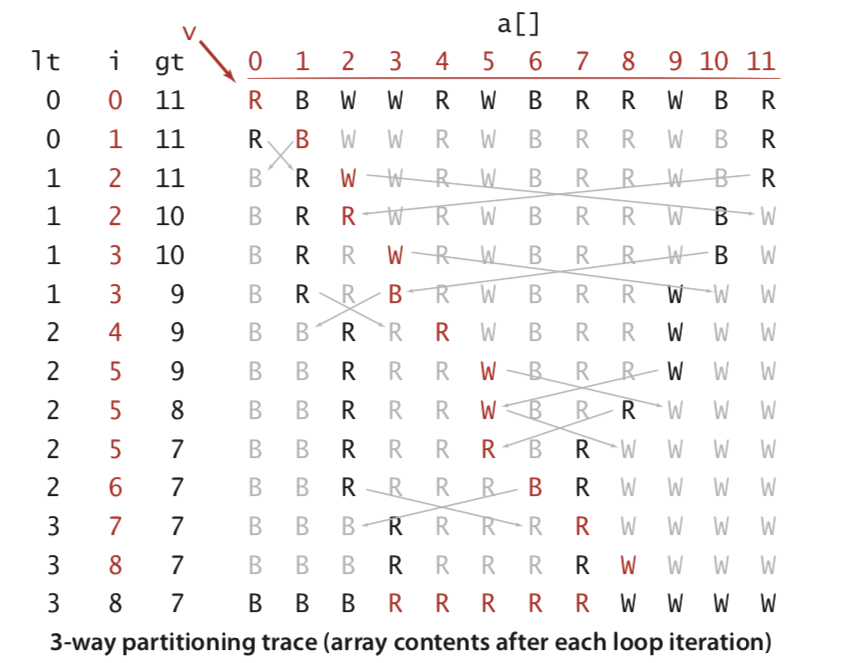

### Visualisation

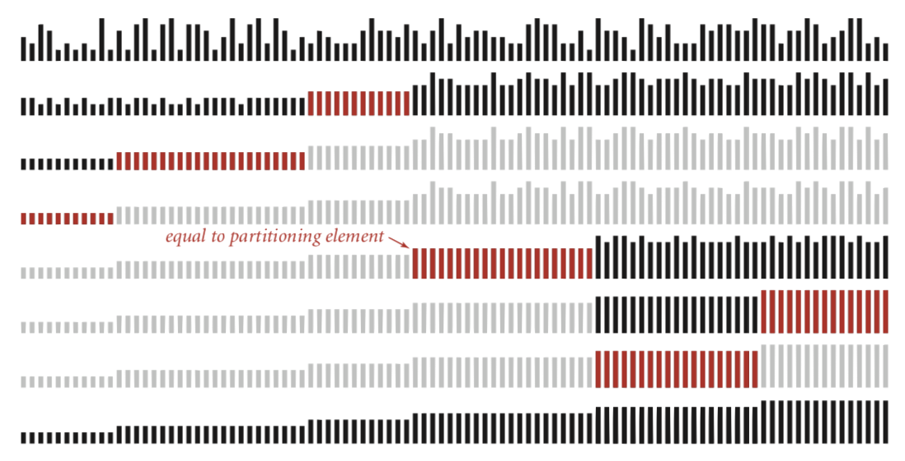

### Lower Bound

If there are $n$ distinct keys and the $i^{th}$ one occurs $x_i$ times, any compare-based sorting algorithm must use at least
$$
\lg(\frac{N!}{x_1!x_2!\dots x_n!}) \sim - \sum_{i=1}^n x_i \lg \frac{x_i}{N}
$$
compares in the worst case

> - $N \lg N$ when all distinct ($x_i = 1$)
> - linear when only a constant number of distinct keys

Proposition: Quicksort with 3-way partitioning is ***entropy-optimal***

> ***Entropy-Optimal***:
>
> Propotional to lower bound

***Buttom Line***:

Randomised quicksort with 3-way partitioning reduces running time from ***linearithmic*** to ***linear*** in broad class of applications

## Sorting Summary

| algorithms  | in-place? | stable> | worst         | average       | best          | remark                                                  |
| ----------- | --------- | ------- | ------------- | ------------- | ------------- | ------------------------------------------------------- |
| selection   | ✔️         |         | $\frac{N^2}2$ | $\frac{N^2}2$ | $\frac{N^2}2$ | $N$ exchanges                                           |
| insertion   | ✔️         | ✔️       | $\frac{N^2}2$ | $\frac{N^2}4$ | $N$           | use for small $N$ or partially order                    |
| shell       | ✔️         |         | ?             | ?             | $N$           | tight code, subquadratic                                |
| merge       |           | ✔️       | $N \lg N$     | $N \lg N$     | $N \lg N$     | $N \log N$ guarantee, stable                            |
| quick       | ✔️         |         | $\frac{N^2}2$ | $2N \ln N$    | $N \lg N$     | $N \log N$ probabilistic guarantee, fastest in practice |
| 3-way quick | ✔️         |         | $\frac{N^2}2$ | $2N \ln N$    | $N$           | improves quicksort in presence of duplicate keys        |
| ???         | ✔️         | ✔️       | $N \lg N$     | $N \lg N$     | $N$           | holy sorting grail 🏆                                    |

