# Lecture 7: Priority Queue

## Priority Queue

***Collection***: inset and delete items

> ***Problem***: which item to delet?

- ***Stack***: LIFO
- ***Queue***: FIFO
- ***Randomised Queue***: remove a random item
- ***Priority Queue***: remove the **largest** (or **smallest**) item

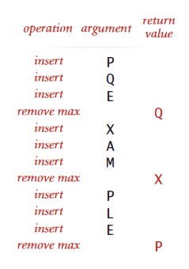

### API

> ***Requirement***: Generic items are `Comparable`

```java
public class MaxPQ<Key extends Comparable<Key>>
    public MaxPQ()
    
    public MaxPQ(Key[] a)
    
    public void insert(Key v)
    
    public boolean isEmpty()
    
    public Key delMax()
    
    public Key max()
    
    public int size()
```

### Client Example

***Challenge***: find the larget $M$ items in a stream of $N$ items

- Fraud detection: isolate large transactions

- File maintenance: find biggest files or directories

> Constraint: not enough memory to store $N$ items

```bash
$ more tinyBatch.txt
Turing 6/17/1990 644.08
vonNeumann 3/26/2002 4121.85
Dijkstra 8/22/2007 2678.40
vonNeumann 1/11/1999 4409.74
Dijkstra 11/18/1995 837.42
Hoare 5/10/1993 3229.27
vonNeumann 2/12/1994 4732.35
Hoare 8/18/1992 4381.21
Turing 1/11/2002 66.10
Thompson 2/27/2000 4747.08
Turing 2/11/1991 2156.86
Hoare 8/12/2003 1025.70
vonNeumann 10/13/1993 2520.97
Dijkstra 9/10/2000 708.95
Turing 10/12/1993 3532.36
Hoare 2/10/2005 4050.20
```

```shell
$ java TopM 5 < tinyBatch.txt
Thompson 2/27/2000 4747.08
vonNeumann 2/12/1994 4732.35
vonNeumann 1/11/1999 4409.74
Hoare 8/18/1992 4381.21
vonNeumann 3/26/2002 4121.85
```

```java
MinPQ<Transaction> pq = new MinPQ<Transaction>();
// Transaction data type is Comparable (ordered by $$)

while (StdIn.hasNextLine()) {
    String line = StdIn.readLine();
    Transaction item = new Transaction(line);
    pq.insert(item);
    if (pq.size()>M)
        pq.delMin()
}
```

#### Order of Growth of Different Solutions

> Finding the largest $M$ in a stream of $N$ items

| Implementation | Time       | Space |
| -------------- | ---------- | ----- |
| sort           | $N \log N$ | $N$   |
| elementary PQ  | $M N$      | $M$   |
| binary heap    | $N \log M$ | $M$   |
| best in theory | $N$        | $M$   |

### Strategies

>  Ordered vs Unordered

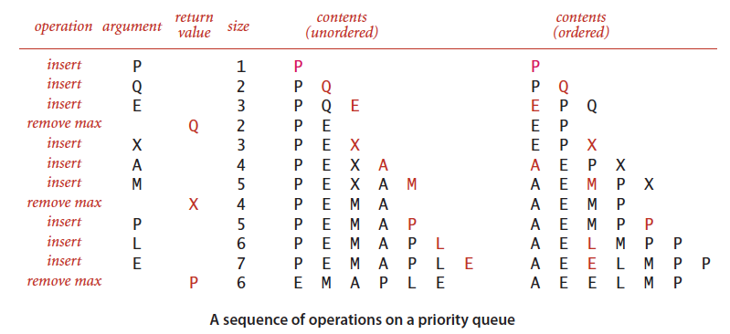

### Unordered Array Implementation

```java
public class UnorderedMaxPQ<Key extends Comparable<Key>> {
    private Key[] pq; // pq[i] = i-th element on pq
    private int N; // number of elements on pq
    
    public UnorderedMaxPQ(int capacity) {
        pq = (Key[]) new Comparable[capacity];
    }
    
    public boolean isEmpty() {
        return N == 0;
    }
    
    public void insert(Key x) {
        pq[N++] = x;
    }
    
    public Key delMax() {
        int max = 0;
        for (int i = 1; i < N; i++) {
            if (less(max, i)) max = i;
        }
        exch(max, N-1);
        return pq[--N]
    }
}
```

### Efficiency

| Implementation  | `insert()` | `delMax()` | `max()`  |
| --------------- | ---------- | ---------- | -------- |
| Unordered Array | $1$        | $N$        | $N$      |
| Ordered Array   | $N$        | $1$        | $1$      |
| ***goal***      | $\log N$   | $\log N$   | $\log N$ |

## Binary Heaps

### Complete Binary Tree

Perfectly balanced, except for bottom level

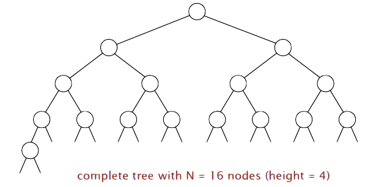

> ***Property***: height of complete tree with $N$ nodes is $\lg N$ since height only increases when $N$ is a power of $2$

### Binary Heap

An array representation of a heap-ordered complete binary tree

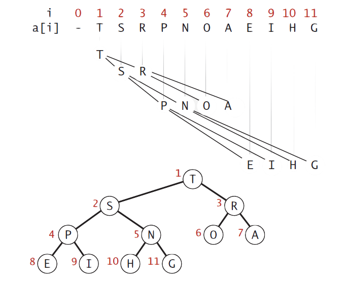

***Heap-Ordered Binary Tree***:

- Keys in nodes
- Parent’s key no smaller than children’s key

***Array Representation***:

- Indices start at $1$
- Take nodes in ***level*** order
- No explicit links needed

***Proposition***: largest key is `a[1]`, which is the root of binary tree

***Proposition***: can use array indices to move through tree

- parent of node at `k` is `k/2`
- children of node at `k` are at `2k` and `2k+1`

### Heap Operations

#### Promotion

>  ***Scenario***: child’s key becomes larger key than its parent’s key

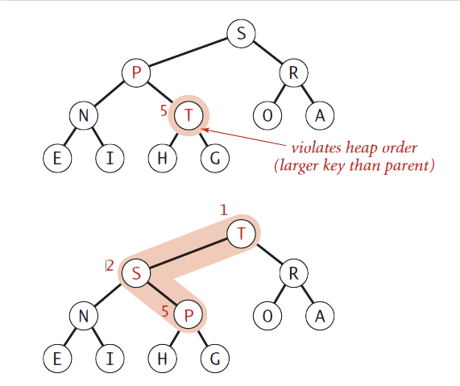

To eliminate the violation:

- Exchange key in child with key in parent
- Repeat until heap order restored

```java
private void swim(int) {
    while (k > 1 && less(k/2, k)) {
        exch(k, k/2);
        k = k/2;
    }
}
```

#### Insertion

Add node at end, then swim it up

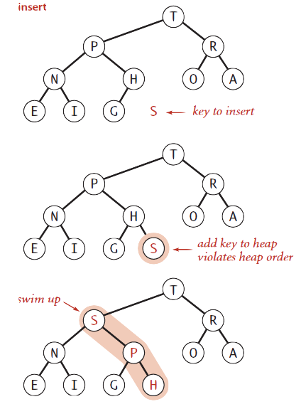

```java
public void insert(Key x) {
    pq[++N] = x;
    swim(N);
}
```

#### Demotion

> ***Senario***: Parent’s key becomes smaller than one (or both) of its children's

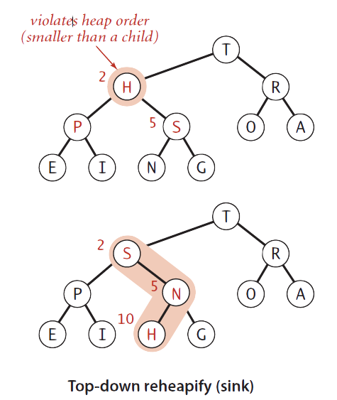

To eliminate the violation:

- Exchange key in paent with key in larger child
- Repeat until heap order restored

```java
private void sink(int k) {
    while (2*k <= N) {
        int j = 2*k;
        if (j < N && less(j, j+1)) j++;
        if (!less(k, j)) break;
        exch(k, j);
        k = j;
    }
}
```

#### Deletion of the Maximum

Exchange root with node at end, then sink it down

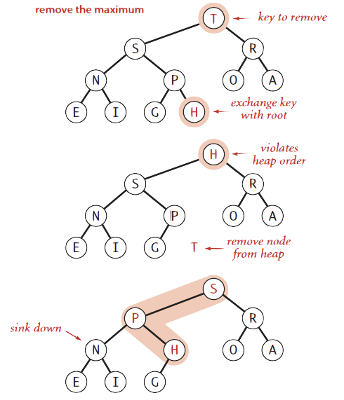

```java
public Key delMax() {
    Key max = pq[1];
    exch(1, N--);
    sink(1);
    pq[N+1] = null; // prevent loitering
    return max;
}
```

### Java Implementation

```java
public class MaxPQ<Key extends Comparable<Key>> {
     private Key[] pq;
     private int N;
     
     public MaxPQ(int capacity) {
          pq = (Key[]) new Comparable[capacity+1];
     }
     
     /* ---PQ operations--- */
     
     public boolean isEmpty() {
          return N == 0;
     }
     
     public void insert(Key key) {
          pq[++N] = x;
    		swim(N);
     }
     
     public Key delMax() {
         Key max = pq[1];
         exch(1, N--);
         sink(1);
         pq[N+1] = null; // prevent loitering
         return max;
     }
     /* ----------------------*/
     
     /* heap helper functions */
     private void swim(int) {
         while (k > 1 && less(k/2, k)) {
             exch(k, k/2);
             k = k/2;
         }
     }
     
     private void sink(int k) {
         while (2*k <= N) {
             int j = 2*k;
             if (j < N && less(j, j+1)) j++;
             if (!less(k, j)) break;
             exch(k, j);
             k = j;
         }
     }
     
     /* -----------------------*/
     
     /* array helper functions */
     private boolean less(int i, int j) {
          return pq[i].compareTo(pq[j]) < 0;
     }
     
     private void exch(int i, int j) {
          Key t = pq[i];
          pq[i] = pq[j];
          pq[j] = t;
     }
     /* -----------------------*/
}
```

### Order of Growth

| Implementation    | `insert()`  | `delMax()`            | `max()` |
| ----------------- | ----------- | --------------------- | ------- |
| unordered array   | $1$         | $N$                   | $N$     |
| ordered array     | $N$         | $1$                   | $1$     |
| ***binary heap*** | *$\log N $* | $\log N $             | $1$     |
| d-ary heap        | $\log_d N$  | $d\log_d N$           | $1$     |
| Fibonacci heap    | $1$         | $\log N $ (amortised) | $1$     |
| *impossible*      | $1$         | $1$                   | $1$     |

### Implementation Considerations

***Immutability of Keys***

-   Assumption: client does not change keys while they're on the PQ
-   **Best practice**: use immutable keys

***Underflow and Overflow***

-   **Underflow**: throw `Exception` if deleting from empty PQ
-   **Overflow**: add no-arg `constructor` and use ***resizing array*** (leads to $\log N$ amortised time per operation)

***Minimum-Orientated Priority Queue***

-   Replace `less()`  with `greater()`
-   Implement `greater()`

***Other Operations***

-   Remove an arbitrary item
-   Change the priority of an item

### Immutability

***Data Type***: set of values and operations on those values

***Immutable Data Type***: cannot change the data type value once created

>   ***Data Type in Practice***
>
>   Immuatble: `String`, `Integer`, `Double`, `Color`, `Vector`, `Transaction`, `Point2D`
>
>   Mutable: `StringBuilder`, `Stack`, `Counter`, Java `Array`

#### Example

```java
public final class Vector { // cannot override instance methods
     
     // all instance variables private and final
     private final int N;
     private final double[] data;
     
     public Vector(double[] data) {
          this.N = data.length;
          this.data = new double[N];
          for (int i = 0; i < N; i++)
               // defensive copy of mutable instance variable
          	this.data[i] = data[i];
     }
     
     // instance methods don't change instance variables
     …
}
```

#### Advantages

-   simplifies debugging
-   safer in presence of hostile code
-   simplifies concurrent programming
-   safe to use as key in priority queue or symbol table

#### Disadvantages

-   must create new object for each data type value

>   ***Note that:*** `String` concatenation creates a new `String`

>   *"Classes should be immutable unless there's a very good reason to make them mutable... If a class cannot be made immutable, you should still imit its mutability as much as possible "* [Bloch, *Effective Java*]

## Heapsort

Create max-heap with all $N$ keys, repeatedly remove the maximum key.

###  First Pass: Heap Construction

Build heap using bottom-up method

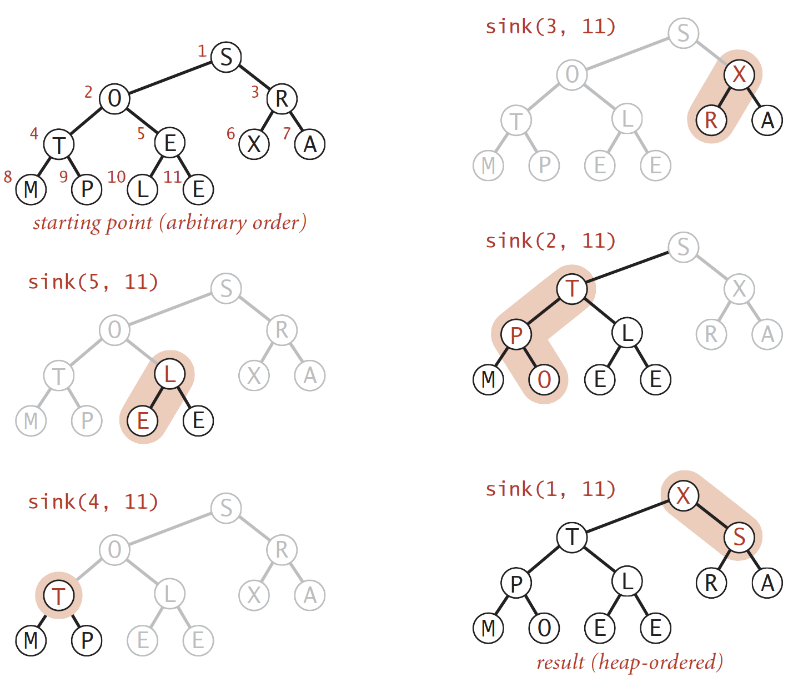

```java
for (int k = N/2; k >= 1; k--) 
     // N/2 since N is one-node heap
     sink(a, k, N);
```

### Second Pass: Sortdown

-   Remove the maximum, one at a time
-   **Leave in array**, insteading of nulling out

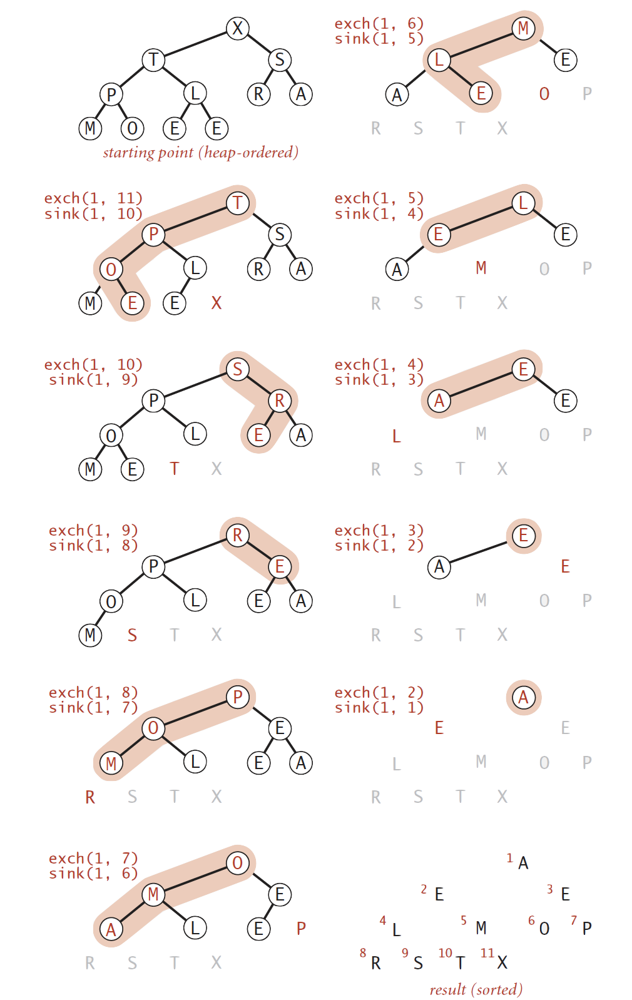

```java
while (N > 1) {
     exch(a, 1, N--);
    	sink(a, 1, N);
}
```

### Java Implementation

```java
public class Heap {
     public static void sort(Comparable[] a) {
          int N = a.length;
          for (int k = N/2; k >= 1; k--)
               sink(a, k, N);
         	while (N > 1) {
               exch(a, 1, N);
               sink(a, 1, --N);
          }
     }
     
     private static void sink(Comparable[] a, int k, int N)
     { /* as before */ }
     
     private static boolean less(Comparable[] a, int i, int j)
     { /* as before */ }
     
     private static void exch(Comparable[] a, int i, int j)
     { /* as before */ }
}
```

### Trace

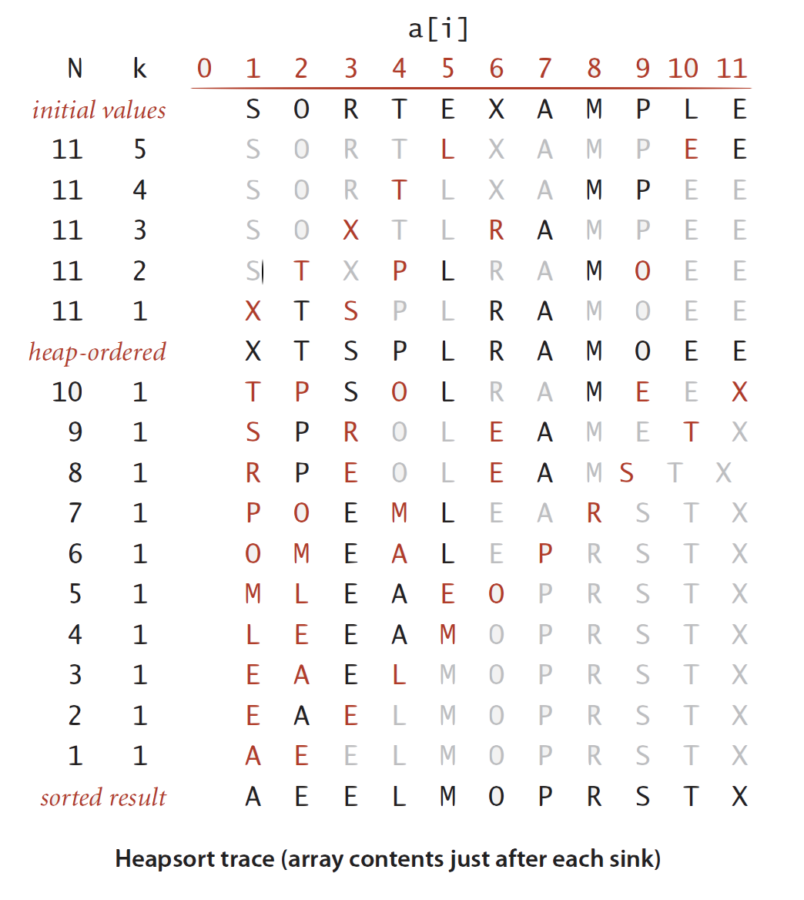

### Mathematical Analysis

>   ***Proposition***: 
>
>   Heap construction uses $\le 2N$ compares and exchanges

>   ***Proposition***: 
>
>   Heapsort uses $\le 2N \lg N$ compares and exchanges

***Significance***: in-place sorting algorithm with $N \log N$ worst-case

-   ***Mergesort***: no, linear extra space. (In-place merge possible but not practical)
-   ***Quicksort***: no, quadratic time in worst case. *($N \log N$ worst-case quicksort possible, not practical)*
-   ***Heapsort***: yes!

***Bottom Line***: Heapsort is optimal for both time and space, but

-   **inner loop longer than quicksort's**
    -   Compare to see are the two children bigger? Then compare
    -   2 compares done at $N \log N$ times
-   **makes poor use of cache memory**
    -   Quicksort refers to something that's nearby something else that is just referred. So no extra costs if a big block of things comes into memory.
    -   Heapsort is looking far away from the current place as it goes down the tree and makes it slower in a lot of situation
-   **not stable**
    -   Due to long distance exchanges that might bring items that have equal keys back out of order

### Sorting Algorithms: Summary

| algorithms  | in-place? | stable> | worst         | average       | best          | remark                                                  |
| ----------- | --------- | ------- | ------------- | ------------- | ------------- | ------------------------------------------------------- |
| selection   | ✔️         |         | $\frac{N^2}2$ | $\frac{N^2}2$ | $\frac{N^2}2$ | $N$ exchanges                                           |
| insertion   | ✔️         | ✔️       | $\frac{N^2}2$ | $\frac{N^2}4$ | $N$           | use for small $N$ or partially order                    |
| shell       | ✔️         |         | ?             | ?             | $N$           | tight code, subquadratic                                |
| merge       |           | ✔️       | $N \lg N$     | $N \lg N$     | $N \lg N$     | $N \log N$ guarantee, stable                            |
| quick       | ✔️         |         | $\frac{N^2}2$ | $2N \ln N$    | $N \lg N$     | $N \log N$ probabilistic guarantee, fastest in practice |
| 3-way quick | ✔️         |         | $\frac{N^2}2$ | $2N \ln N$    | $N$           | improves quicksort in presence of duplicate keys        |
| ***heap***  | ✔️         |         | $2 N \lg N$   | $2 N \lg N$   | $ N \lg N$    | $N \lg N$ guarantee, in-place                           |
| ???         | ✔️         | ✔️       | $N \lg N$     | $N \lg N$     | $N$           | holy sorting grail 🏆                                    |
